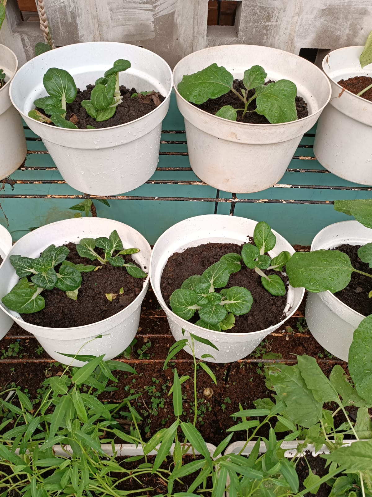

# 20 Juli 2025 - Log Kegiatan Harian
[Kembali](readme.md)

## 📌 Kegiatan
1. Memasak:
   - Kegiatan: Membuat roti bagel sandwich
   - Alat/bahan: Pisau, talenan, roti bagel, greek yoghurt homemade.
   - Durasi: 120 menit

2. Berkebun:
   - Kegiatan: Menyiram tanaman dan semprot pestisida.
   - Alat/bahan: Air, pestisida
   - Durasi: 30 menit

## 🎯 Capaian Kegiatan
- Aasiyah membantu ummah membuat roti.
- Aasiyah menyiram tanaman dan semprot pestisida.
- Aasiyah belajar mengenai hama tanaman.

## 🚧 Kendala
- 

## 🖼️ Dokumentasi Kegiatan

[Kembali](readme.md)