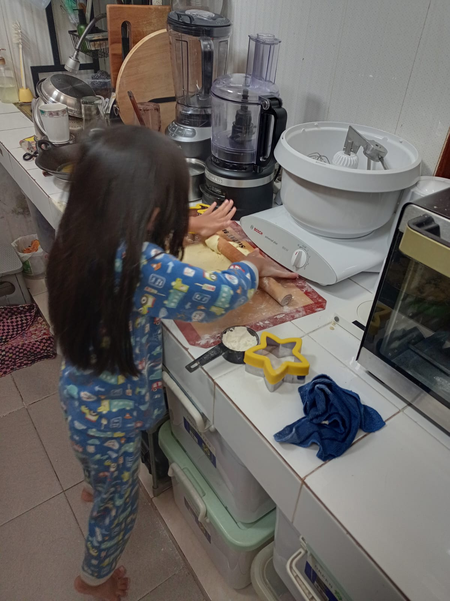
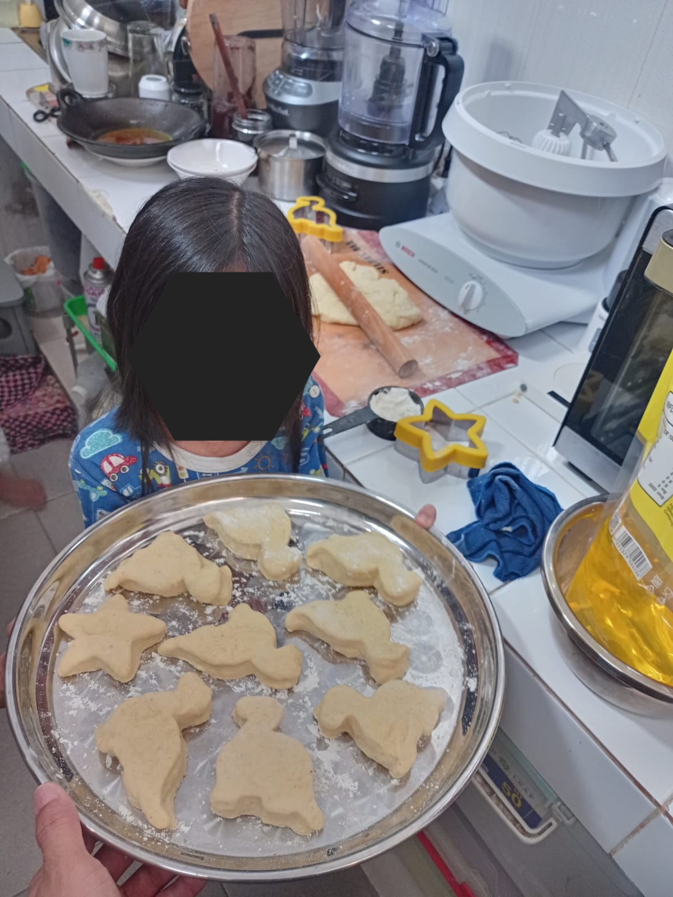

# 27 Juli 2025 - Log Kegiatan Harian
[Kembali](readme.md)

## 📌 Kegiatan
1. Baking:
   - Kegiatan: Membuat donat
   - Alat/Bahan: Oven, tepung, gula, telur, mentega
   - Durasi: 60 menit

## 🎯 Capaian Kegiatan
- Donut berbagai bentuk.

## 🚧 Kendala
- 

## 🖼️ Dokumentasi Kegiatan

[Kembali](readme.md)