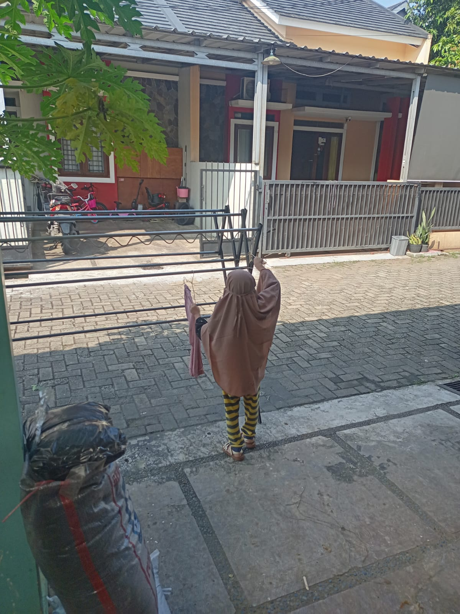

# 02 Agustus 2025 - Log Kegiatan Harian
[Kembali](readme.md)

## 📌 Kegiatan
1. Basic Life Skill:
   - Kegiatan: Mencuci dan menjemur pakaian
   - Alat/bahan: Mesin cuci, jemuran, pakaian.
   - Durasi: 60 menit

## 🎯 Capaian Kegiatan
- Hari ini Aasiyah yang membantu mencuci pakaian dan menjemurnya.

## 🚧 Kendala
- 

## 🖼️ Dokumentasi Kegiatan

[Kembali](readme.md)