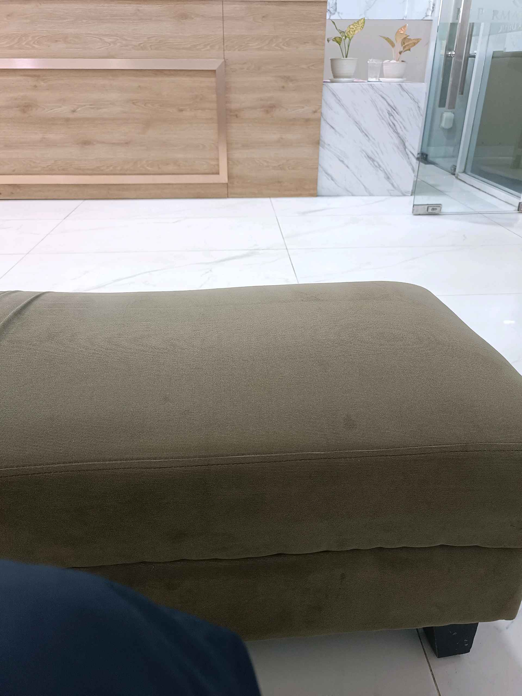

# 20 Januari 2026 - Log Kegiatan Harian
[Kembali](readme.md)

## 📌 Kegiatan
1. Kegiatan Utama:
   - Kegiatan: Menemani keluarga ke fasilitas kesehatan saat Abang membutuhkan perawatan, dan ikut menunggu dengan sabar.
   - Alat/bahan: -
   - Durasi: -

## 🎯 Capaian Kegiatan
- Melatih empati dan kesabaran saat menemani saudara yang sedang sakit.

## 🚧 Kendala
- 

## 🖼️ Dokumentasi Kegiatan

[Kembali](readme.md)
