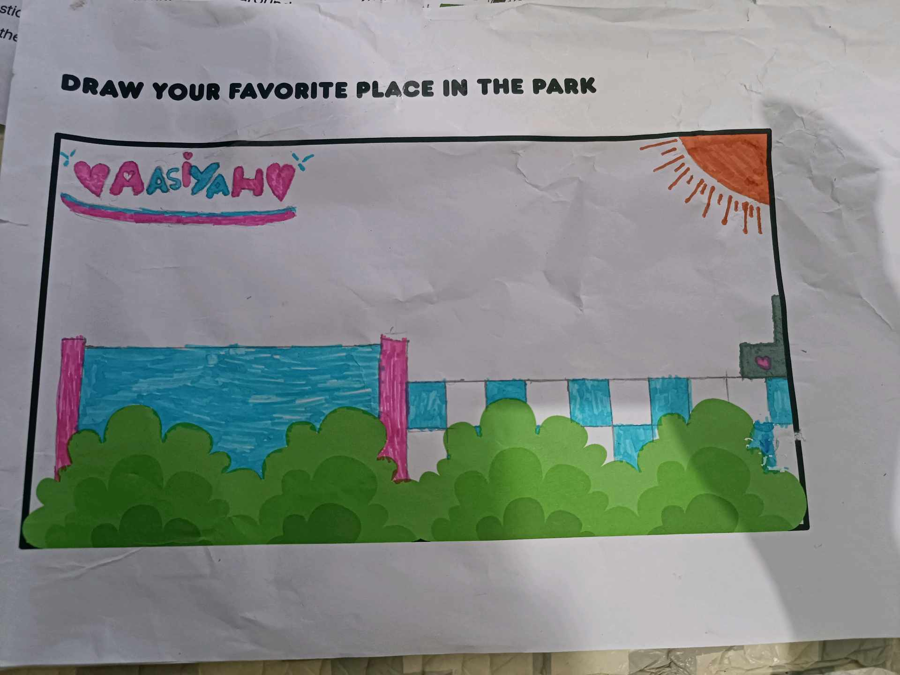
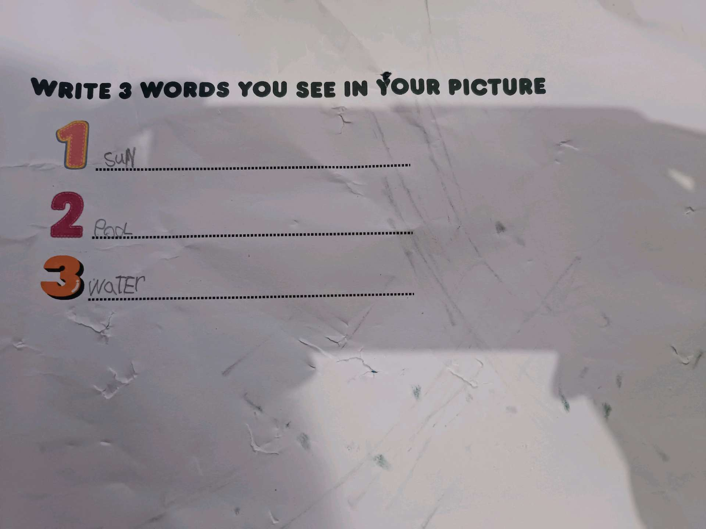
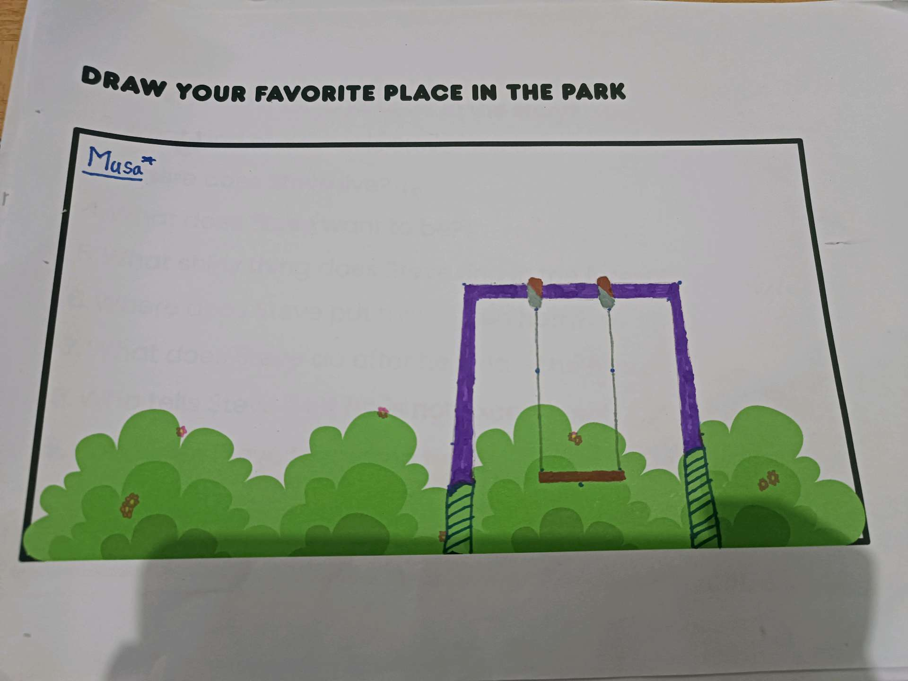
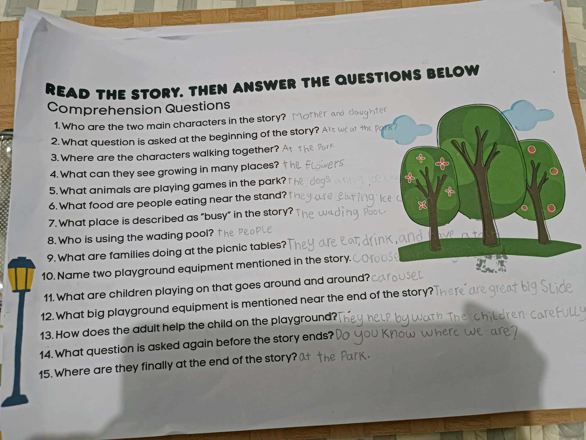
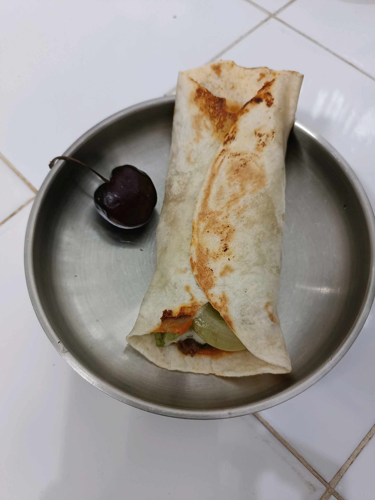

# 1 Februari 2026 - Log Kegiatan Harian
[Kembali](readme.md)

## 📌 Kegiatan
1. Kegiatan Utama:
   - Kegiatan: Mengerjakan reading comprehension bahasa Inggris (menjawab pertanyaan tentang cerita di taman) dan membuat wrap/kebab homemade untuk camilan.
   - Alat/bahan: Lembar reading comprehension; tortilla, isian sayur dan daging, buah ceri.
   - Durasi: -

## 🎯 Capaian Kegiatan
- Menjawab pertanyaan pemahaman bacaan (reading comprehension) dalam bahasa Inggris.
- Menggulung wrap sendiri dan menyajikannya.

## 🚧 Kendala
- 

## 🖼️ Dokumentasi Kegiatan

[Kembali](readme.md)
