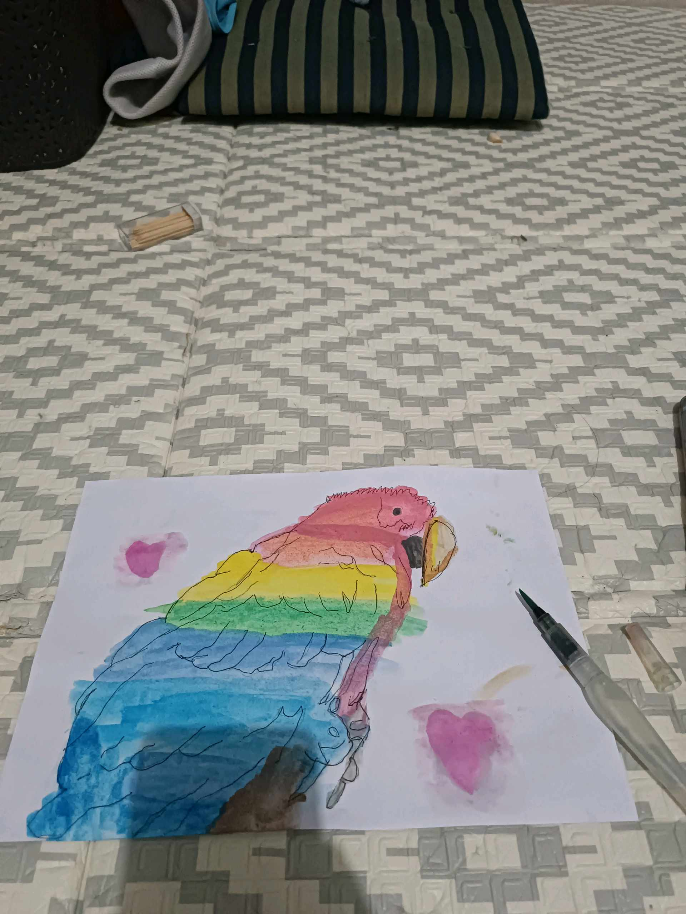
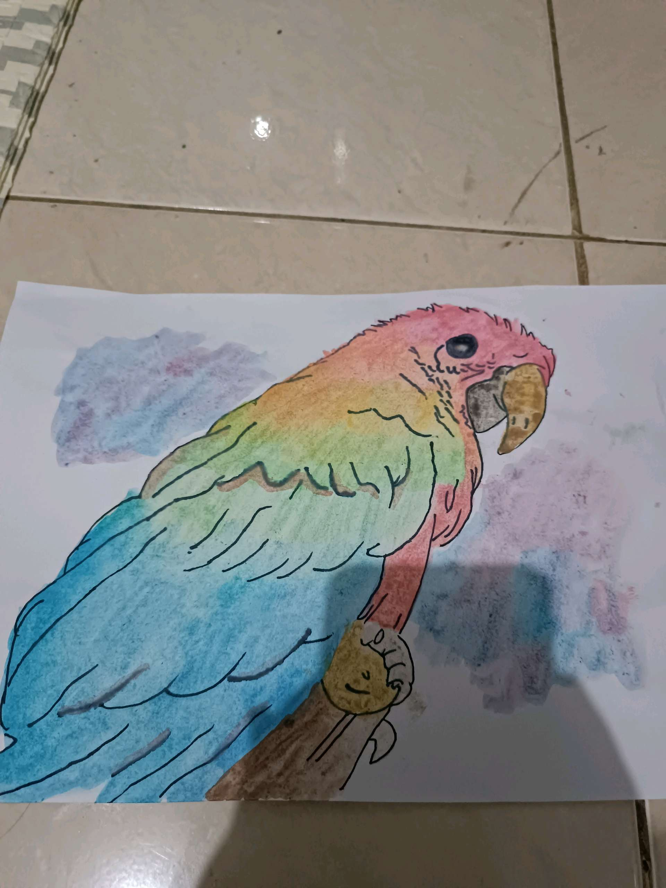
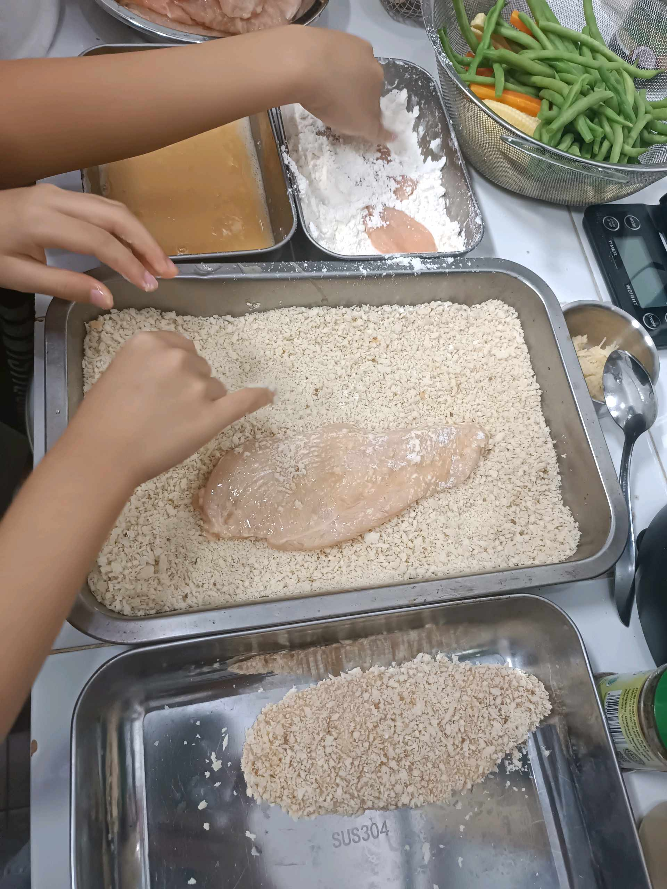
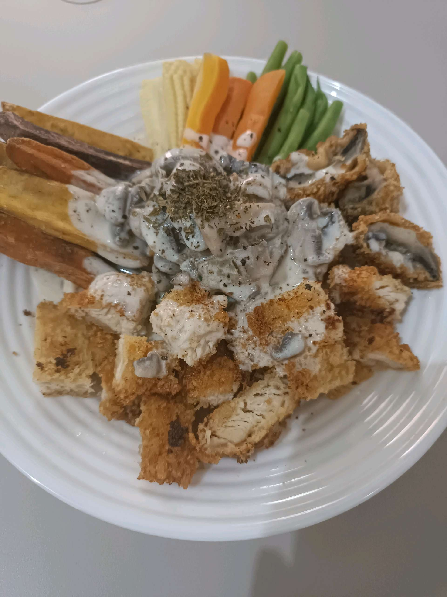
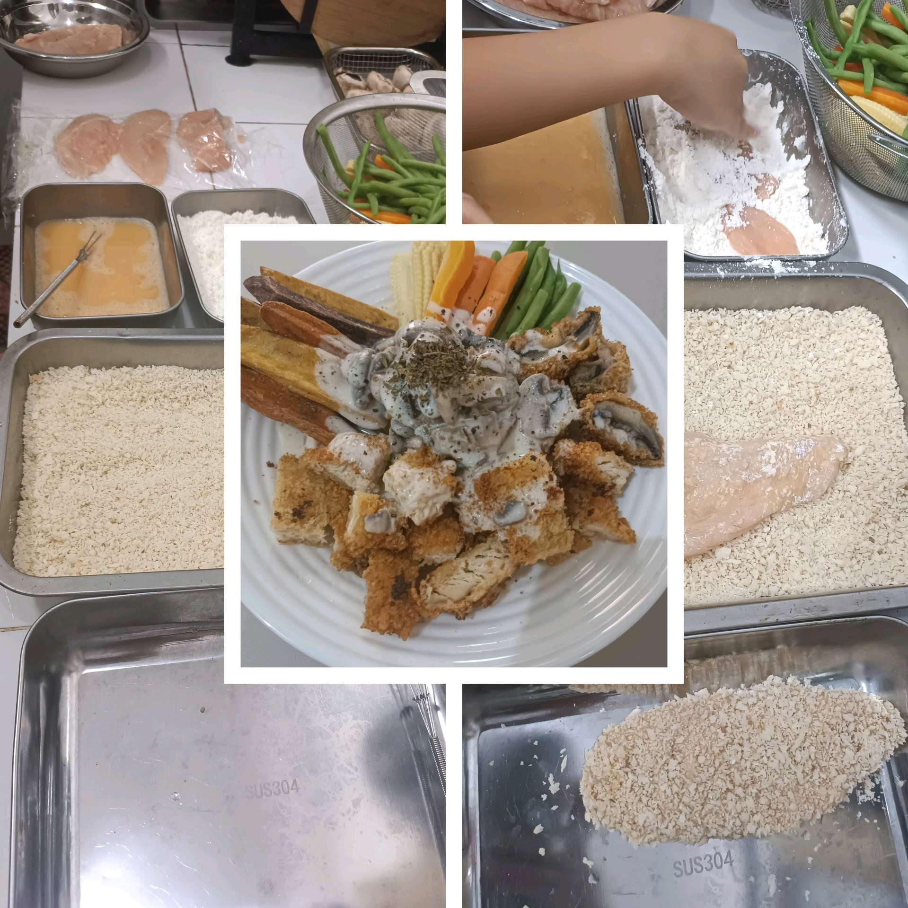

# 30 Januari 2026 - Log Kegiatan Harian
[Kembali](readme.md)

## 📌 Kegiatan
1. Kegiatan Utama:
   - Kegiatan: Melukis cat air bertema burung beo (parrot) dengan gradasi warna pelangi, lalu mengikuti SC cooking class membuat chicken katsu dengan saus jamur krim dan aneka sayuran.
   - Alat/bahan: Cat air, kuas, kertas lukis; dada ayam, tepung, telur, tepung panko, jamur, wortel, buncis, baby corn.
   - Durasi: -

## 🎯 Capaian Kegiatan
- Menyelesaikan lukisan cat air burung beo dengan gradasi warna.
- Mempraktikkan teknik breading (tepung-telur-panko) dan menata hidangan katsu.

## 🚧 Kendala
- 

## 🖼️ Dokumentasi Kegiatan

[Kembali](readme.md)
