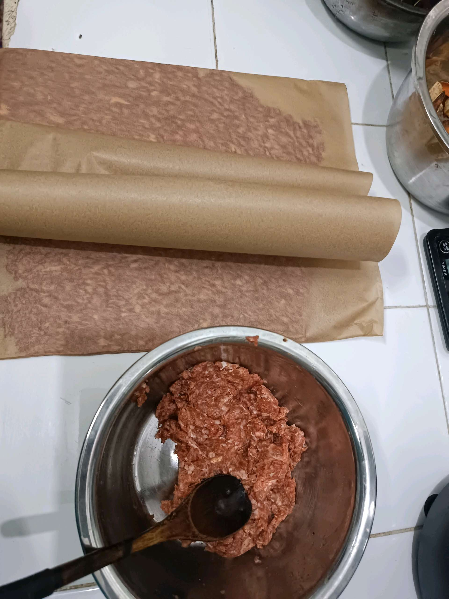
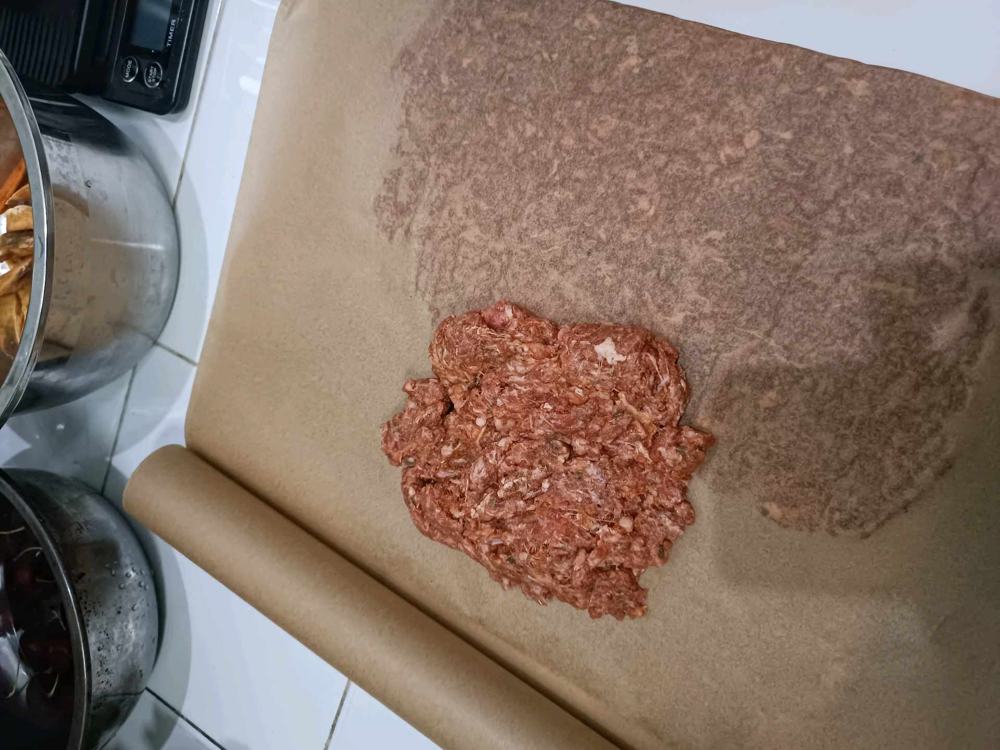
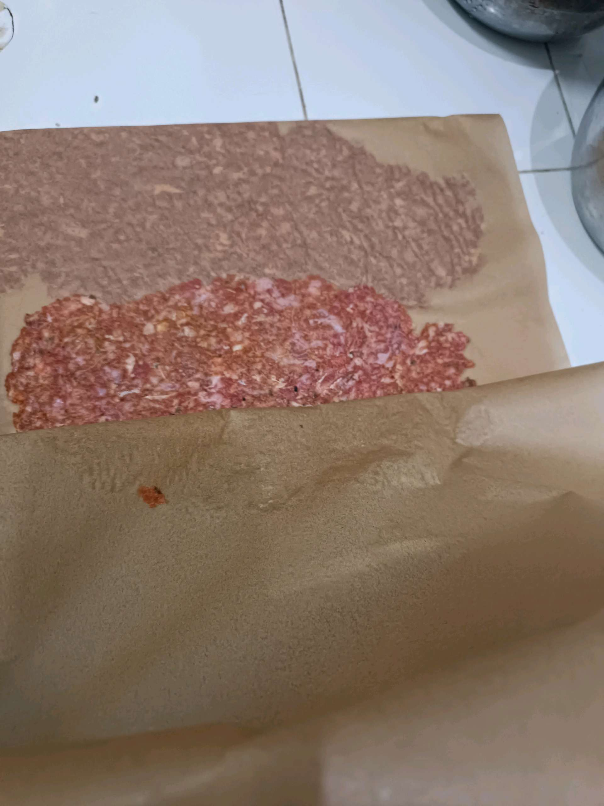
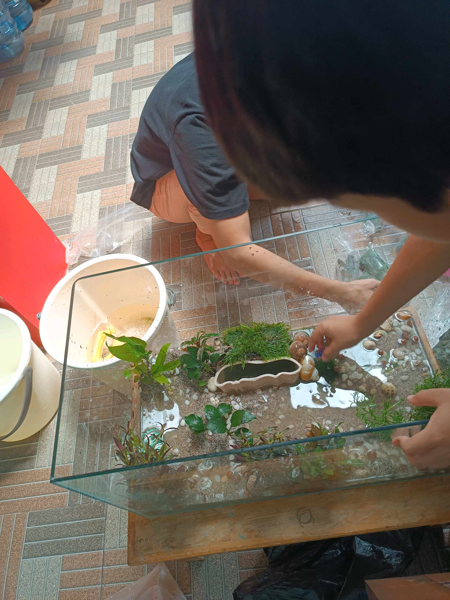
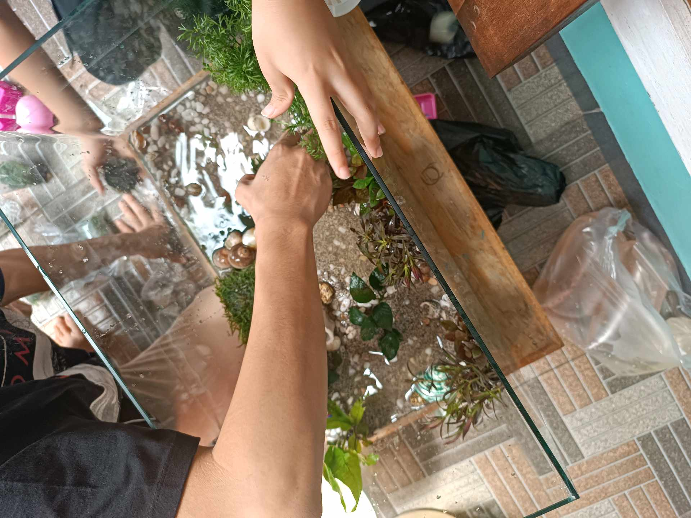

# 31 Januari 2026 - Log Kegiatan Harian
[Kembali](readme.md)

## 📌 Kegiatan
1. Kegiatan Utama:
   - Kegiatan: Membantu membuat olahan daging giling homemade (membentuk dan memipihkan adonan di atas kertas baking), serta mengerjakan tugas bahasa Inggris menggambar tempat favorit di taman dan menulis kosakata.
   - Alat/bahan: Daging giling, bumbu, kertas baking, mangkuk; lembar kerja bahasa Inggris, pensil/spidol warna.
   - Durasi: -

## 🎯 Capaian Kegiatan
- Membantu menyiapkan olahan daging giling di dapur.
- Menggambar tempat favorit (kolam renang) dan menulis 3 kosakata bahasa Inggris: sun, pool, water.

## 🚧 Kendala
- 

## 🖼️ Dokumentasi Kegiatan

[Kembali](readme.md)
