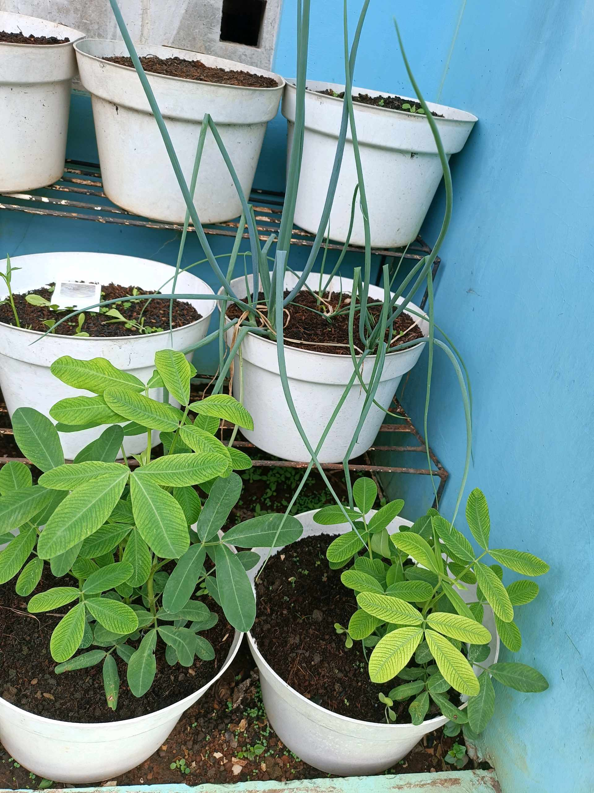
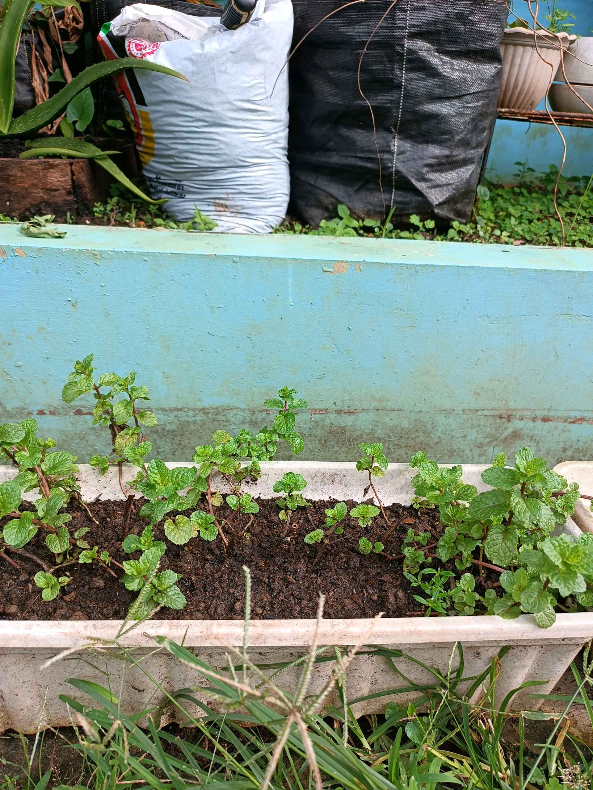
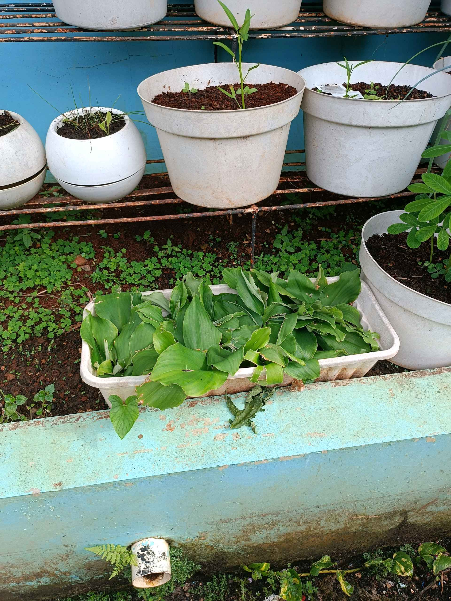
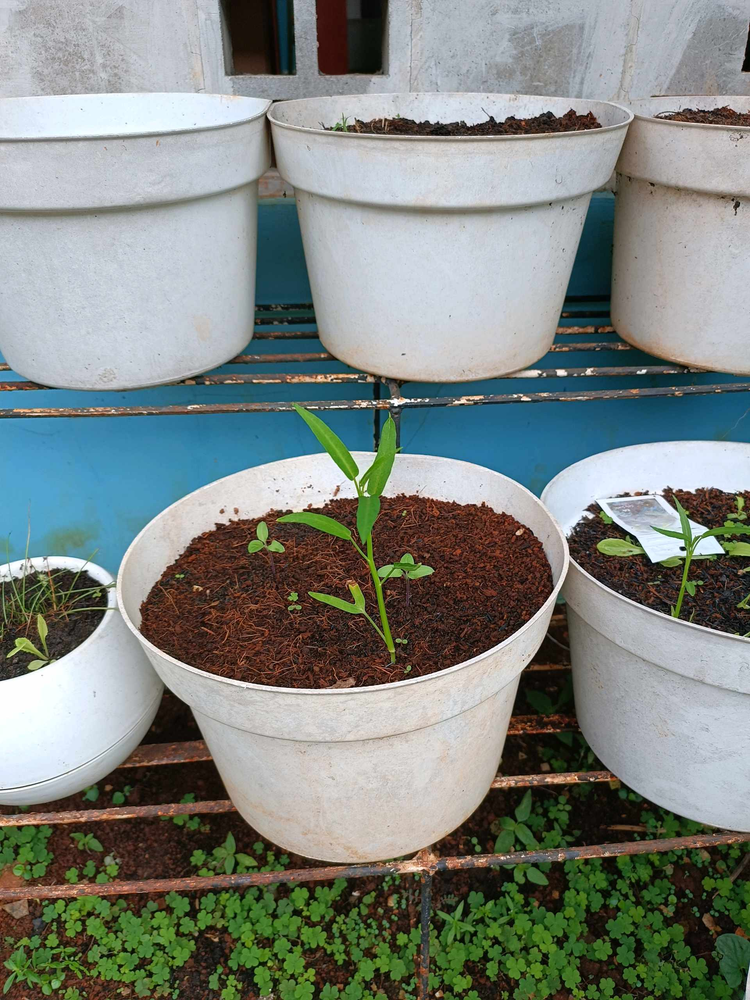

# 2 Februari 2026 - Log Kegiatan Harian
[Kembali](readme.md)

## 📌 Kegiatan
1. Kegiatan Utama:
   - Kegiatan: Merawat dan mengamati tanaman di kebun urban farming depan rumah - menyiram daun bawang, mint, kacang tanah, dan cabai, serta memanen daun kunyit.
   - Alat/bahan: Tanaman pot (daun bawang, mint, kacang tanah, cabai, kunyit), gembor/air.
   - Durasi: -

## 🎯 Capaian Kegiatan
- Merawat tanaman dan mengamati pertumbuhan semaian.
- Memanen daun kunyit dari kebun sendiri.

## 🚧 Kendala
- 

## 🖼️ Dokumentasi Kegiatan

[Kembali](readme.md)
