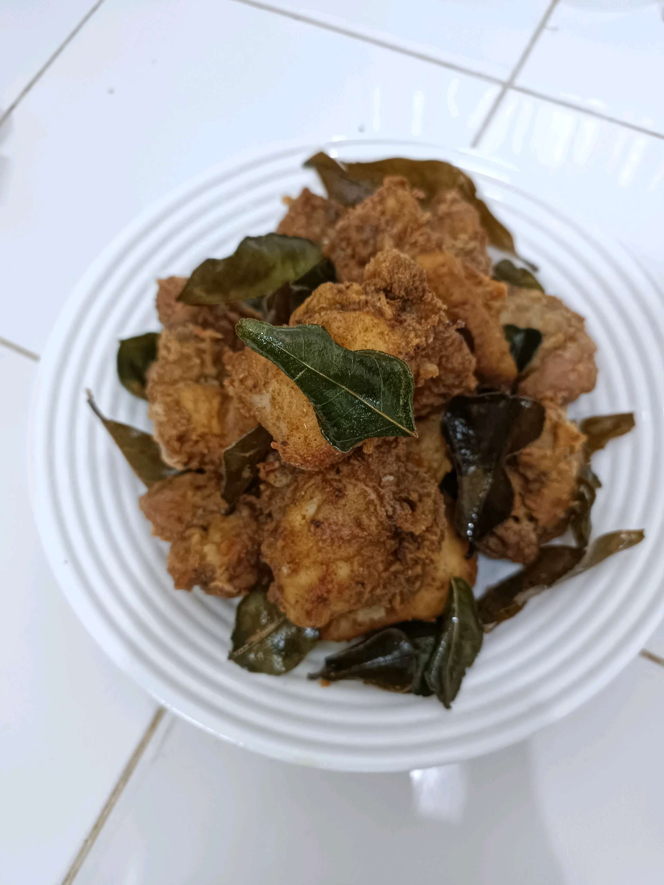
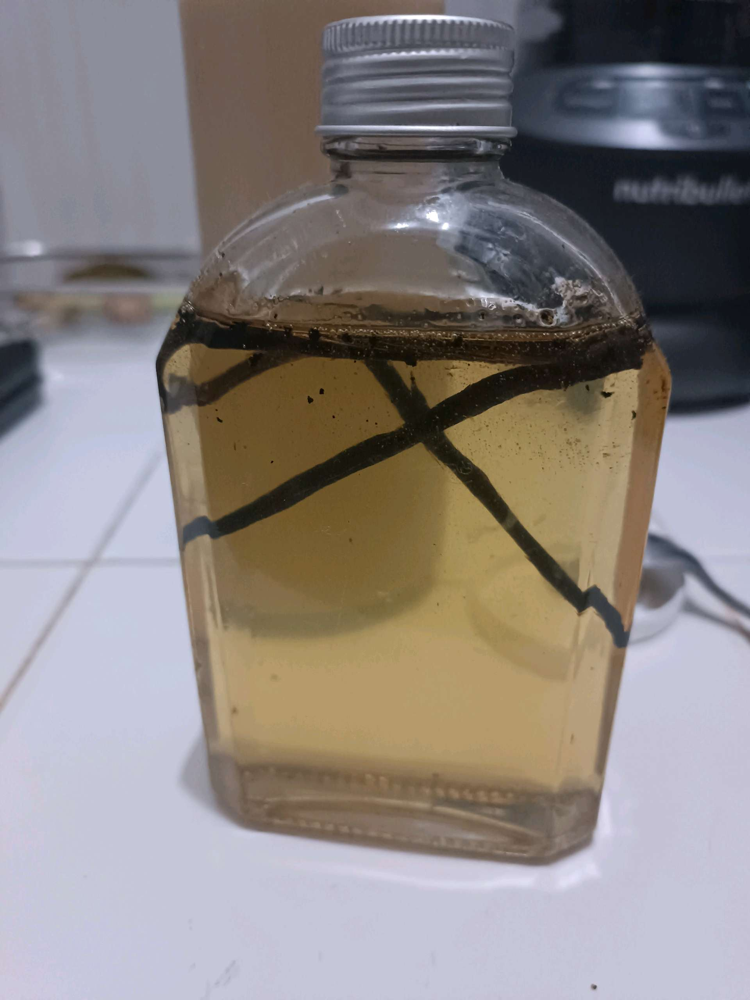

# 3 Februari 2026 - Log Kegiatan Harian
[Kembali](readme.md)

## 📌 Kegiatan
1. Kegiatan Utama:
   - Kegiatan: Membantu memasak ayam goreng berbumbu daun aromatik, serta menyiapkan larutan rendaman rempah dalam botol.
   - Alat/bahan: Ayam, bumbu, daun aromatik, minyak; botol kaca, rempah.
   - Durasi: -

## 🎯 Capaian Kegiatan
- Membantu menggoreng dan menata ayam berbumbu.
- Mengamati proses pembuatan larutan rempah.

## 🚧 Kendala
- 

## 🖼️ Dokumentasi Kegiatan

[Kembali](readme.md)
