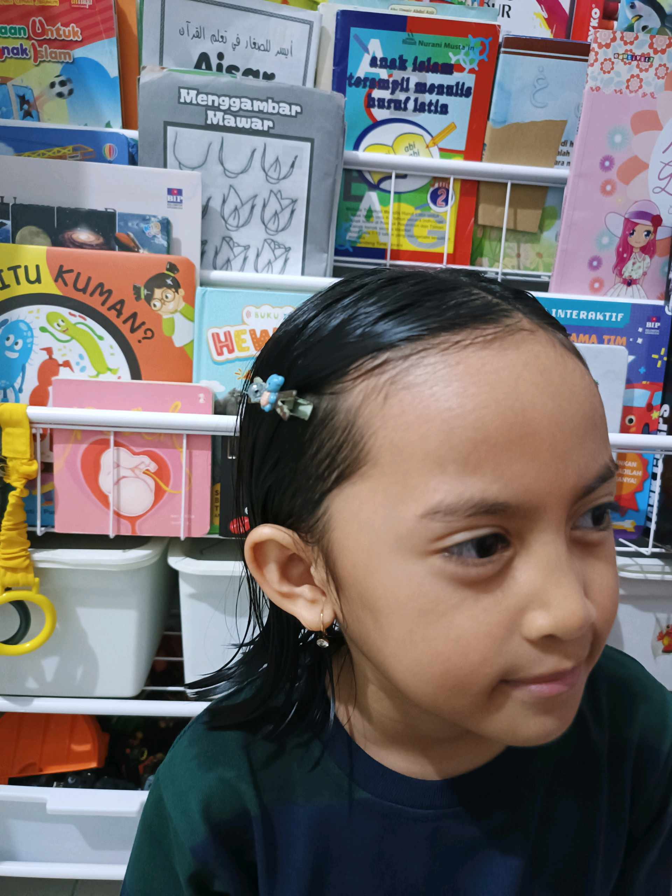
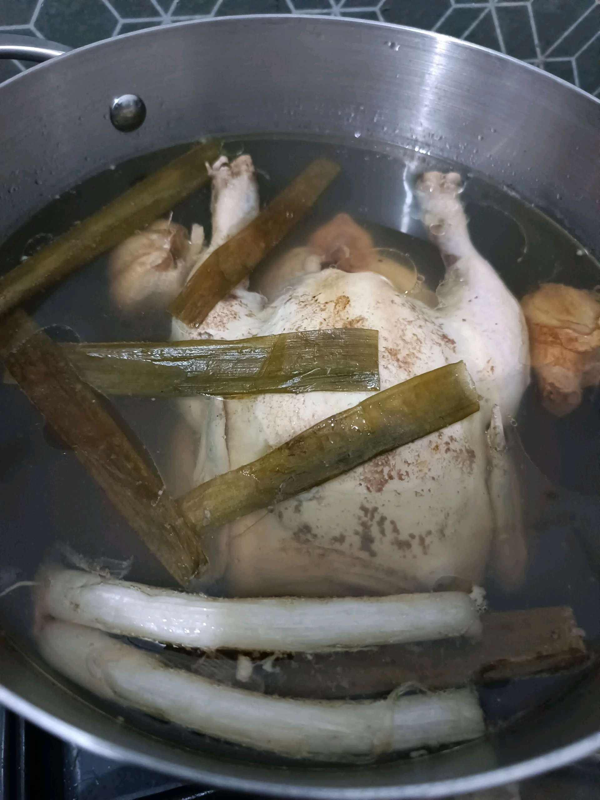
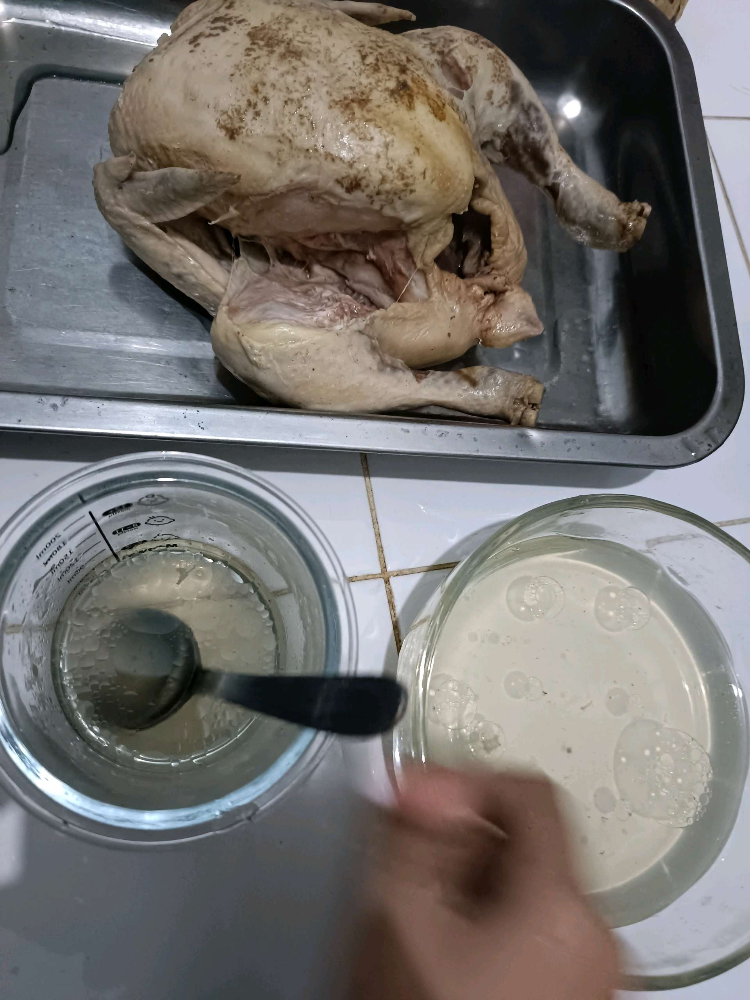
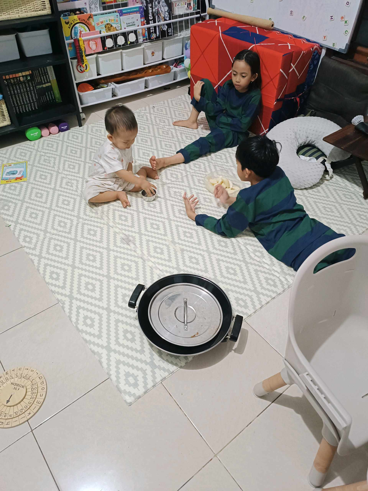

# 5 Februari 2026 - Log Kegiatan Harian
[Kembali](readme.md)

## 📌 Kegiatan
1. Kegiatan Utama:
   - Kegiatan: Membaca dari koleksi buku di rumah, membantu menyiapkan kaldu dan ungkep ayam utuh di dapur, lalu bermain bersama adik dan abang.
   - Alat/bahan: Buku bacaan; ayam utuh, serai, lengkuas, bumbu ungkep, panci.
   - Durasi: -

## 🎯 Capaian Kegiatan
- Melanjutkan latihan membaca.
- Membantu membuat kaldu ayam untuk masakan keluarga.

## 🚧 Kendala
- 

## 🖼️ Dokumentasi Kegiatan

[Kembali](readme.md)
