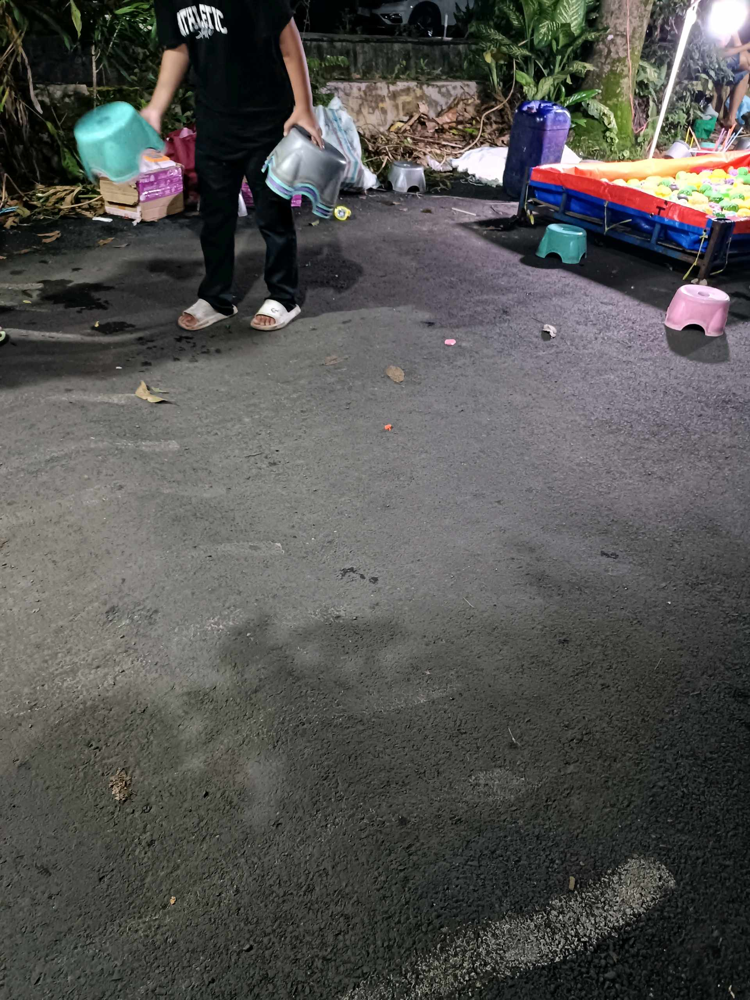

# 7 Februari 2026 - Log Kegiatan Harian
[Kembali](readme.md)

## 📌 Kegiatan
1. Kegiatan Utama:
   - Kegiatan: Menyelesaikan dua lukisan cat air (unicorn memegang es krim dan pot bunga biru), serta ikut keluarga membeli kebutuhan di luar pada malam hari.
   - Alat/bahan: Cat air, kuas, kertas lukis.
   - Durasi: -

## 🎯 Capaian Kegiatan
- Menyelesaikan dua karya lukis dengan tema berbeda.

## 🚧 Kendala
- 

## 🖼️ Dokumentasi Kegiatan

[Kembali](readme.md)
