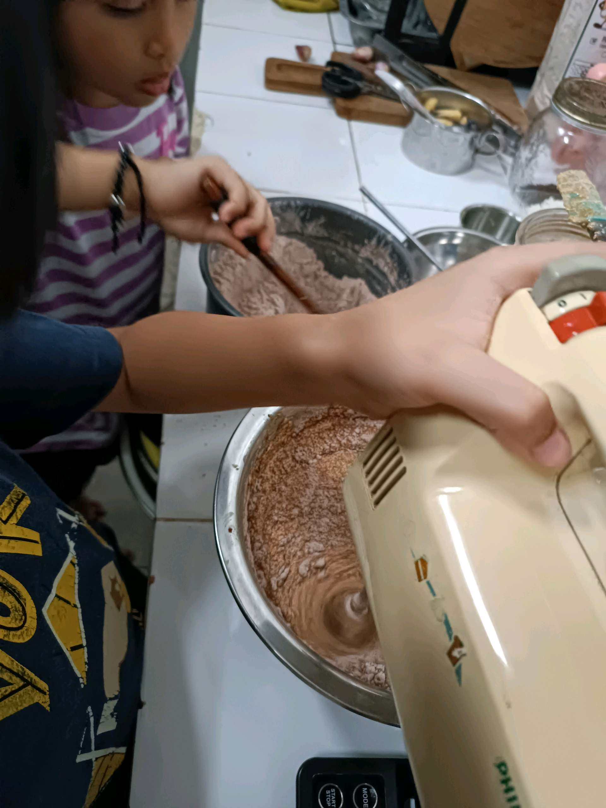

# 9 Februari 2026 - Log Kegiatan Harian
[Kembali](readme.md)

## 📌 Kegiatan
1. Kegiatan Utama:
   - Kegiatan: Mengamati semaian yang mulai tumbuh di kebun, membuat adonan kue cokelat dengan mixer, dan membaca buku bersama adik.
   - Alat/bahan: Tepung, cokelat, telur, gula, mixer; buku bacaan.
   - Durasi: -

## 🎯 Capaian Kegiatan
- Mengamati pertumbuhan kecambah/semaian.
- Membantu membuat adonan kue cokelat.

## 🚧 Kendala
- 

## 🖼️ Dokumentasi Kegiatan

[Kembali](readme.md)
