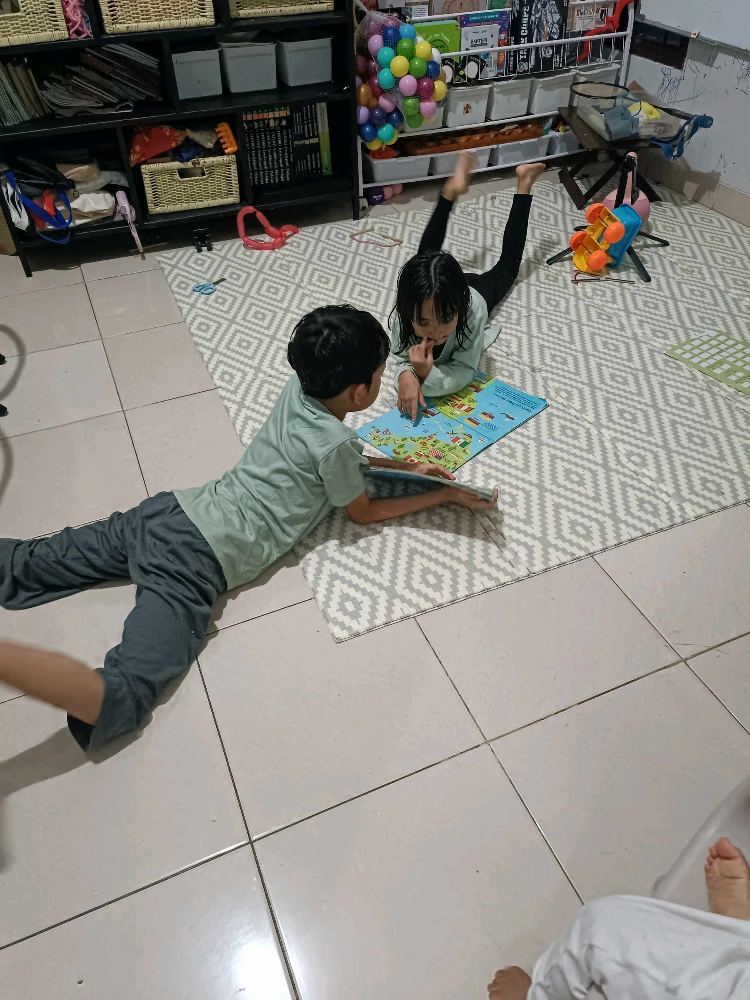

# 10 Februari 2026 - Log Kegiatan Harian
[Kembali](readme.md)

## 📌 Kegiatan
1. Kegiatan Utama:
   - Kegiatan: Mengerjakan reading comprehension bahasa Inggris dari cerita 'The Terrible Trip Up!' dan membaca buku bersama abang.
   - Alat/bahan: Lembar soal reading comprehension; buku cerita.
   - Durasi: -

## 🎯 Capaian Kegiatan
- Menjawab soal pilihan ganda pemahaman bacaan dalam bahasa Inggris.

## 🚧 Kendala
- 

## 🖼️ Dokumentasi Kegiatan

[Kembali](readme.md)
