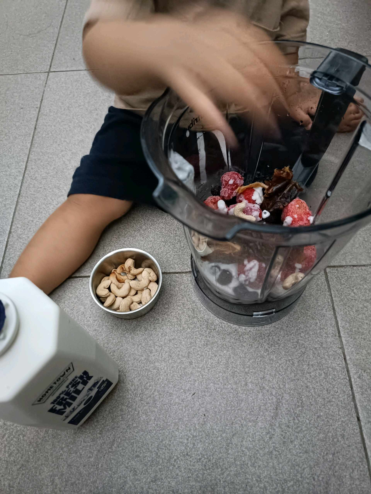

# 11 Februari 2026 - Log Kegiatan Harian
[Kembali](readme.md)

## 📌 Kegiatan
1. Kegiatan Utama:
   - Kegiatan: Membuat smoothie dari buah beri beku (raspberry dan blackberry) dengan kacang mete menggunakan blender.
   - Alat/bahan: Buah beri beku, kacang mete, blender.
   - Durasi: -

## 🎯 Capaian Kegiatan
- Membantu membuat minuman buah sehat sendiri.

## 🚧 Kendala
- 

## 🖼️ Dokumentasi Kegiatan

[Kembali](readme.md)
