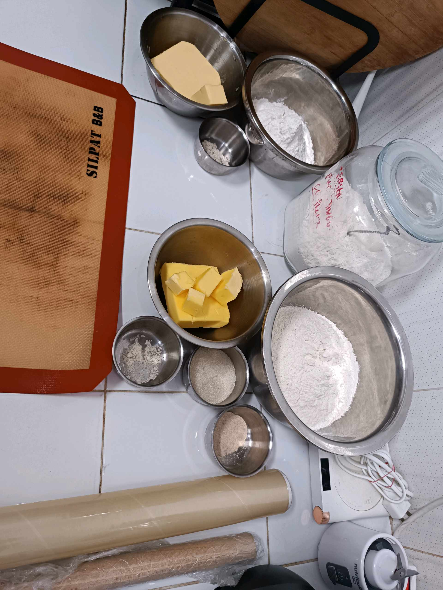

# 13 Februari 2026 - Log Kegiatan Harian
[Kembali](readme.md)

## 📌 Kegiatan
1. Kegiatan Utama:
   - Kegiatan: Membuat croissant homemade - menggilas dan membentuk adonan, lalu memanggangnya hingga matang keemasan.
   - Alat/bahan: Tepung, mentega, ragi, telur; rolling pin, silpat, loyang, oven.
   - Durasi: -

## 🎯 Capaian Kegiatan
- Menyelesaikan croissant homemade dengan bentuk rapi.
- Berlatih teknik menggilas dan menggulung adonan.

## 🚧 Kendala
- 

## 🖼️ Dokumentasi Kegiatan

[Kembali](readme.md)
