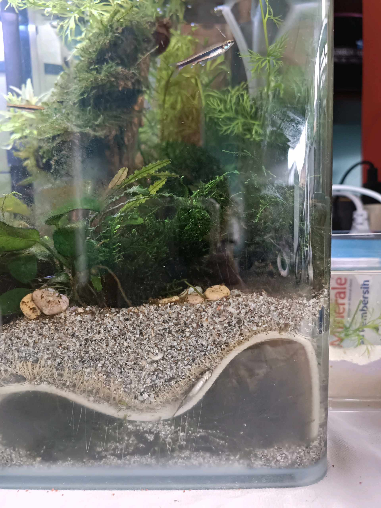

# 16 Februari 2026 - Log Kegiatan Harian
[Kembali](readme.md)

## 📌 Kegiatan
1. Kegiatan Utama:
   - Kegiatan: Mengamati akuarium aquascape - memperhatikan ikan dan pertumbuhan tanaman air.
   - Alat/bahan: Akuarium aquascape.
   - Durasi: -

## 🎯 Capaian Kegiatan
- Mengamati perkembangan ekosistem akuarium.

## 🚧 Kendala
- 

## 🖼️ Dokumentasi Kegiatan

[Kembali](readme.md)
