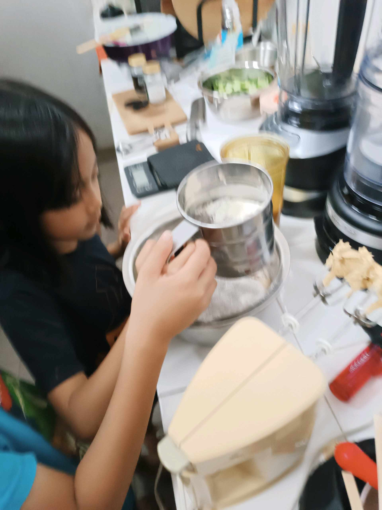
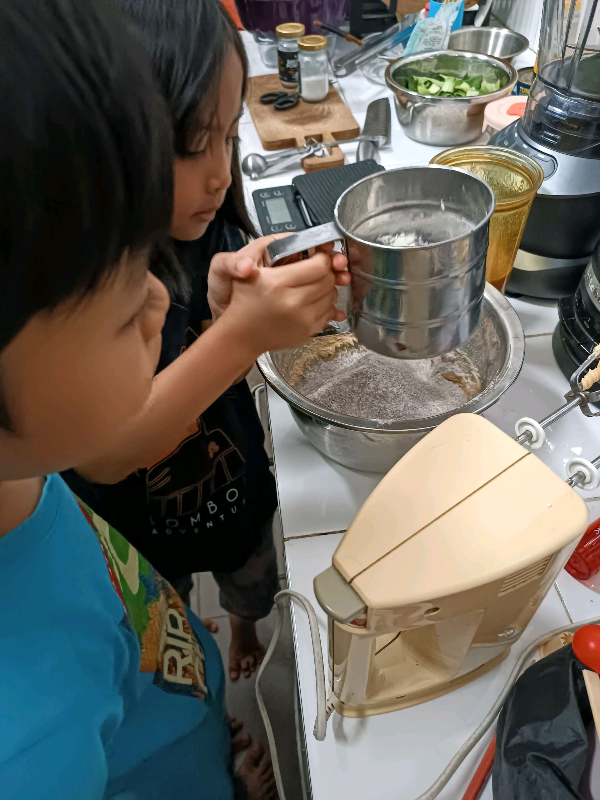

# 19 Februari 2026 - Log Kegiatan Harian
[Kembali](readme.md)

## 📌 Kegiatan
1. Kegiatan Utama:
   - Kegiatan: Membuat adonan kue bersama abang - mengayak dan menimbang tepung serta mengocok adonan dengan mixer, lalu melukis cat air bertema potongan buah pir.
   - Alat/bahan: Tepung, telur, gula, mentega, mixer, ayakan; cat air, kuas, kertas.
   - Durasi: -

## 🎯 Capaian Kegiatan
- Membantu menyiapkan dan menakar bahan kue.
- Menyelesaikan lukisan cat air studi buah pir.

## 🚧 Kendala
- 

## 🖼️ Dokumentasi Kegiatan

[Kembali](readme.md)
