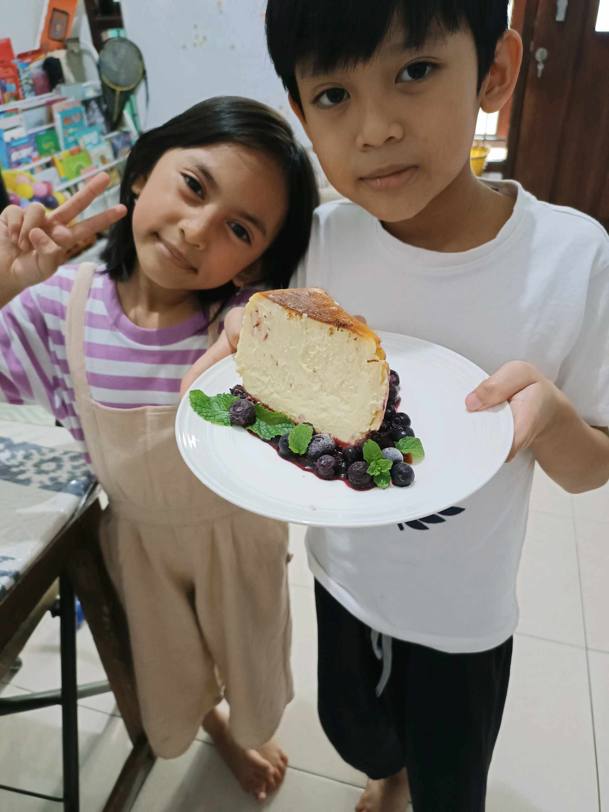
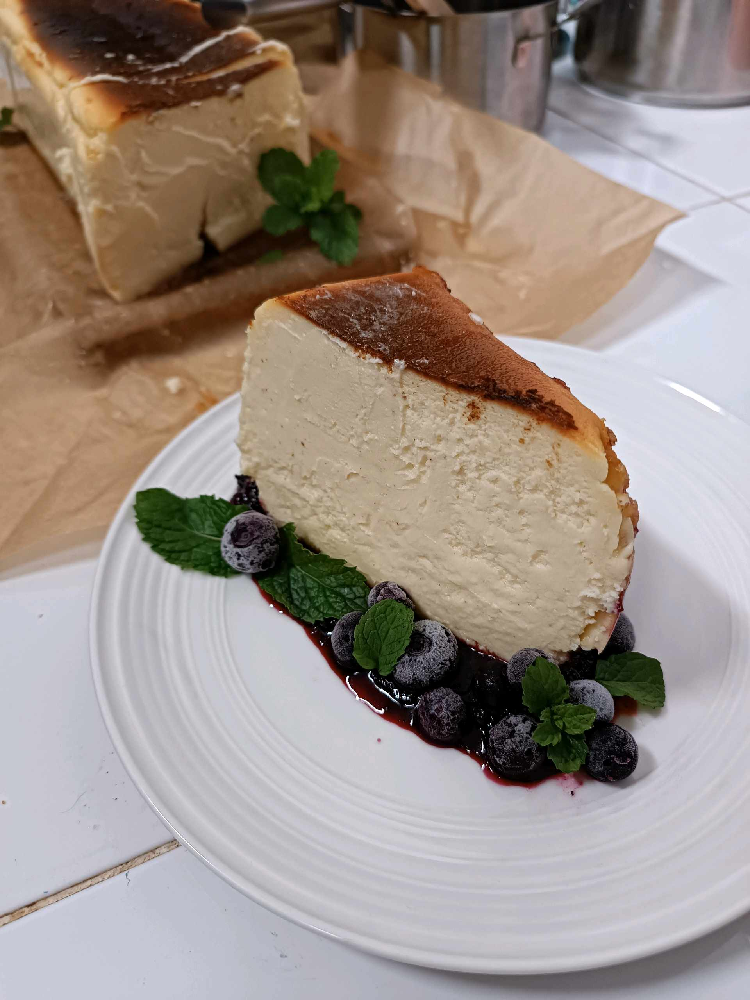
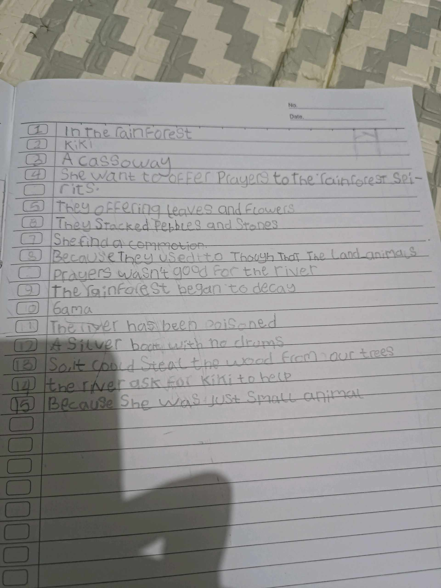

# 1 Maret 2026 - Log Kegiatan Harian
[Kembali](readme.md)

## 📌 Kegiatan
1. Kegiatan Utama:
   - Kegiatan: Menyajikan burnt cheesecake (plating dengan blueberry dan daun mint), mengerjakan reading comprehension cerita tentang Kiki dan rainforest, serta merawat kebun.
   - Alat/bahan: Cheesecake, blueberry, daun mint; lembar reading comprehension; tanaman pot (kelor, seledri, terong).
   - Durasi: -

## 🎯 Capaian Kegiatan
- Menata (plating) hidangan dengan rapi dan menarik.
- Menjawab soal pemahaman bacaan bahasa Inggris.

## 🚧 Kendala
- 

## 🖼️ Dokumentasi Kegiatan

[Kembali](readme.md)
