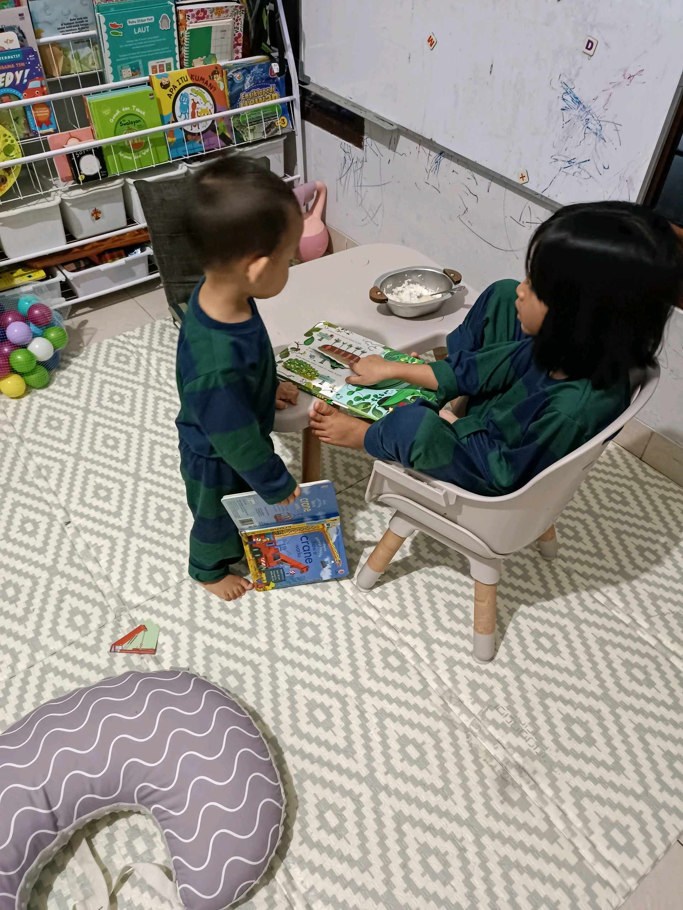

# 24 Februari 2026 - Log Kegiatan Harian
[Kembali](readme.md)

## 📌 Kegiatan
1. Kegiatan Utama:
   - Kegiatan: Belajar membaca dengan permainan word wheel fonik dan kartu kata bahasa Inggris (kid, bid, man, hat, rug), serta bermain bersama adik dan abang.
   - Alat/bahan: Word wheel fonik, kartu kata bergambar.
   - Durasi: -

## 🎯 Capaian Kegiatan
- Berlatih membaca kata-kata CVC dalam bahasa Inggris.
- Bermain edukatif bersama saudara.

## 🚧 Kendala
- 

## 🖼️ Dokumentasi Kegiatan

[Kembali](readme.md)
