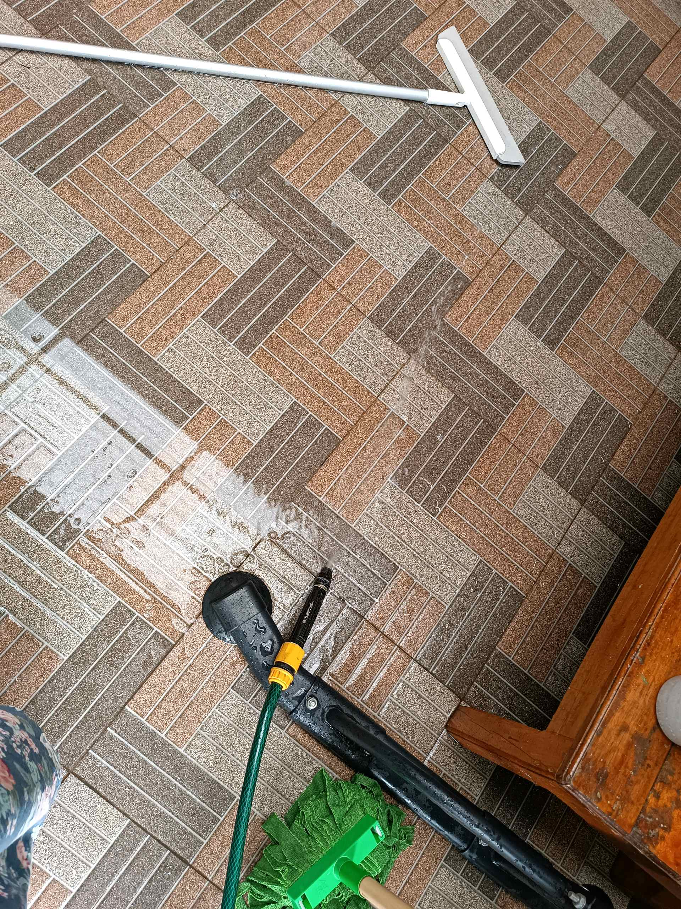

# 27 Februari 2026 - Log Kegiatan Harian
[Kembali](readme.md)

## 📌 Kegiatan
1. Kegiatan Utama:
   - Kegiatan: Membantu pekerjaan rumah membersihkan dan mengepel lantai.
   - Alat/bahan: Alat pel, wiper, air.
   - Durasi: -

## 🎯 Capaian Kegiatan
- Bertanggung jawab atas kebersihan rumah.
- Menyelesaikan tugas rumah dengan mandiri.

## 🚧 Kendala
- 

## 🖼️ Dokumentasi Kegiatan

[Kembali](readme.md)
