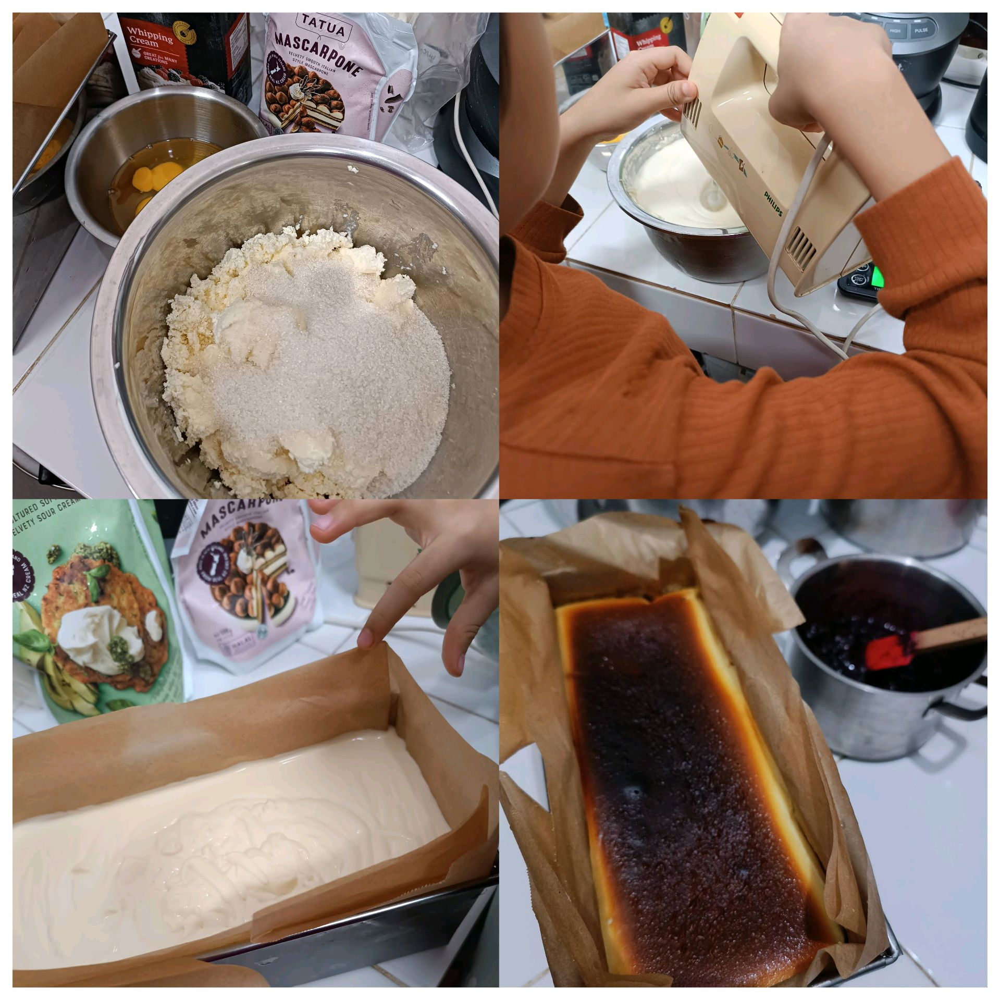

# 28 Februari 2026 - Log Kegiatan Harian
[Kembali](readme.md)

## 📌 Kegiatan
1. Kegiatan Utama:
   - Kegiatan: Membuat burnt cheesecake - mengocok adonan cream cheese, menuang ke loyang, dan memanggang hingga permukaannya kecokelatan.
   - Alat/bahan: Cream cheese, telur, gula, tepung, krim, mixer, loyang, oven.
   - Durasi: -

## 🎯 Capaian Kegiatan
- Membantu seluruh tahap membuat burnt cheesecake.
- Berlatih mengocok dan menakar adonan.

## 🚧 Kendala
- 

## 🖼️ Dokumentasi Kegiatan

[Kembali](readme.md)
