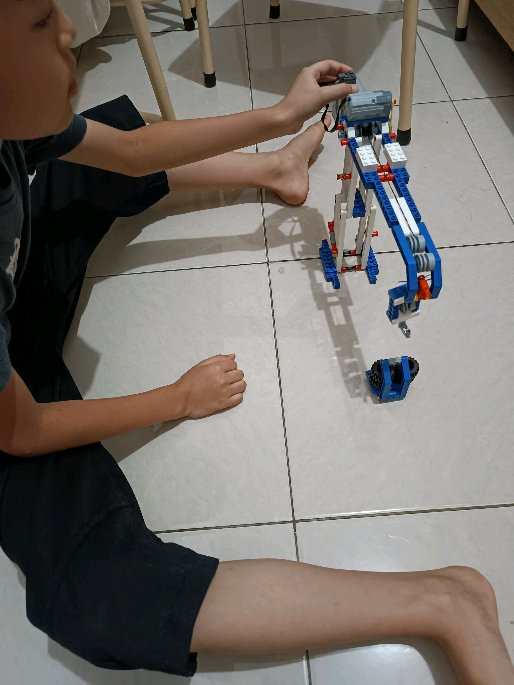

# 2 Maret 2026 - Log Kegiatan Harian
[Kembali](readme.md)

## 📌 Kegiatan
1. Kegiatan Utama:
   - Kegiatan: Ikut merakit dan mengamati LEGO Technic - membangun derek (crane) dengan roda gigi, katrol, dan motor bersama abang.
   - Alat/bahan: LEGO Technic (roda gigi, katrol, motor).
   - Durasi: -

## 🎯 Capaian Kegiatan
- Mengamati cara kerja mekanisme roda gigi dan katrol.
- Bekerja sama membangun konstruksi.

## 🚧 Kendala
- 

## 🖼️ Dokumentasi Kegiatan

[Kembali](readme.md)
