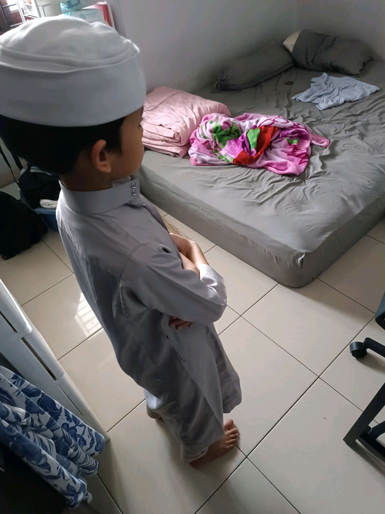

# 4 Maret 2026 - Log Kegiatan Harian
[Kembali](readme.md)

## 📌 Kegiatan
1. Kegiatan Utama:
   - Kegiatan: Menjalankan ibadah di bulan Ramadan bersama keluarga.
   - Alat/bahan: -
   - Durasi: -

## 🎯 Capaian Kegiatan
- Membiasakan ibadah dan adab di bulan Ramadan.

## 🚧 Kendala
- 

## 🖼️ Dokumentasi Kegiatan

[Kembali](readme.md)
