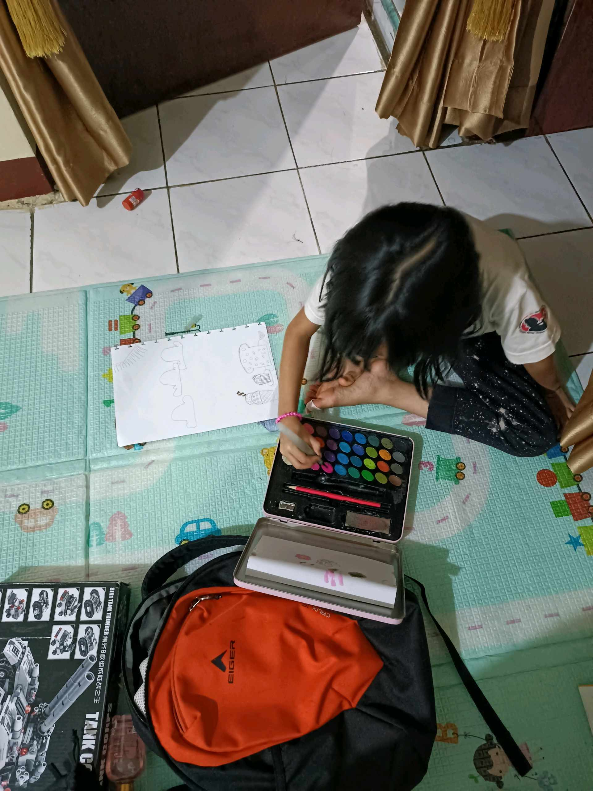
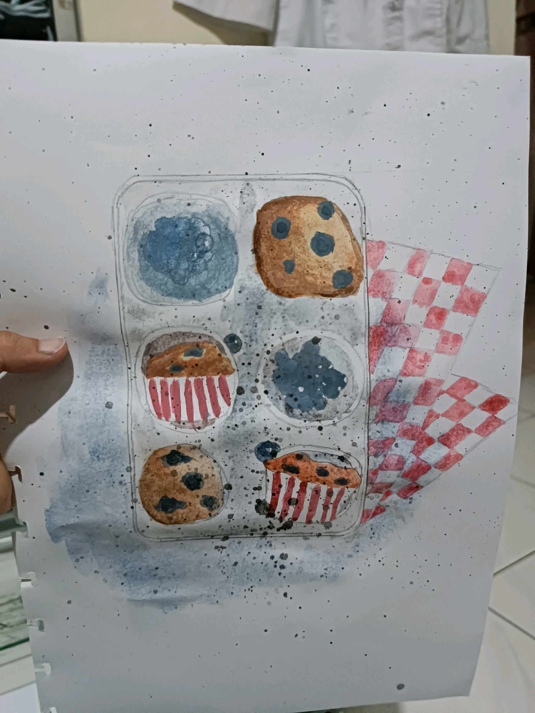

# 7 Maret 2026 - Log Kegiatan Harian
[Kembali](readme.md)

## 📌 Kegiatan
1. Kegiatan Utama:
   - Kegiatan: Melukis cat air bersama keluarga dengan tema muffin (blueberry muffin).
   - Alat/bahan: Cat air, kuas, kertas lukis.
   - Durasi: -

## 🎯 Capaian Kegiatan
- Menyelesaikan lukisan cat air dengan detail tekstur muffin.

## 🚧 Kendala
- 

## 🖼️ Dokumentasi Kegiatan

[Kembali](readme.md)
