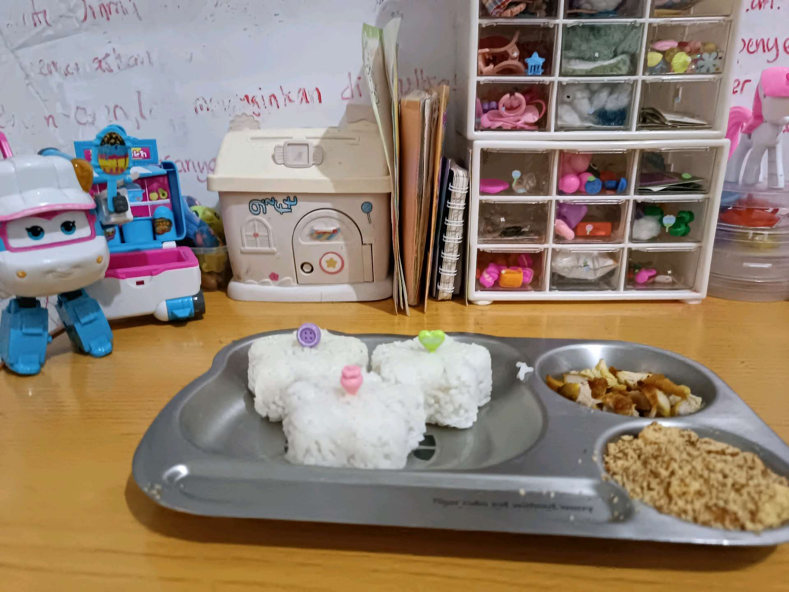
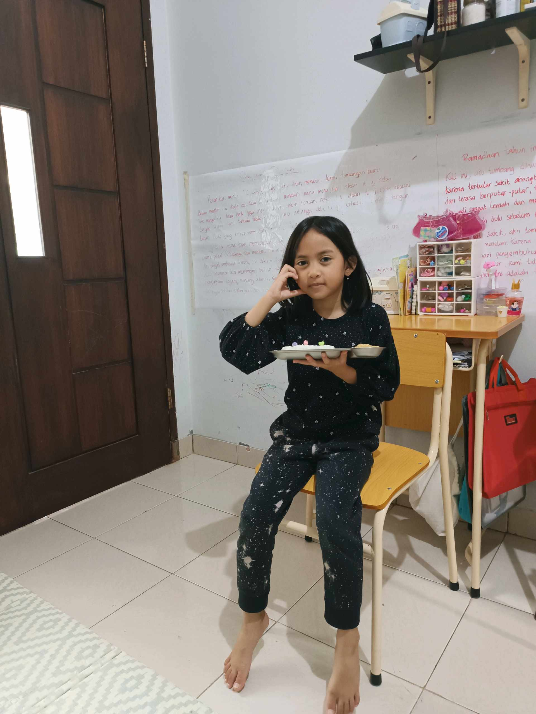

# 6 April 2026 - Log Kegiatan Harian
[Kembali](readme.md)

## 📌 Kegiatan
1. Kegiatan Utama:
   - Kegiatan: Menyiapkan dan menikmati bekal makan berbentuk lucu - nasi dibentuk menyerupai karakter dengan hiasan tusuk warna-warni, dilengkapi telur dan serundeng, serta menikmati puding roti panggang bertabur kacang dan kismis.
   - Alat/bahan: Nasi, cetakan/tusuk makanan, telur, serundeng; roti, susu, kismis, kacang.
   - Durasi: -

## 🎯 Capaian Kegiatan
- Berlatih menata makanan (food plating) agar menarik.
- Membantu menyiapkan bekal makan keluarga.

## 🚧 Kendala
- 

## 🖼️ Dokumentasi Kegiatan

[Kembali](readme.md)
