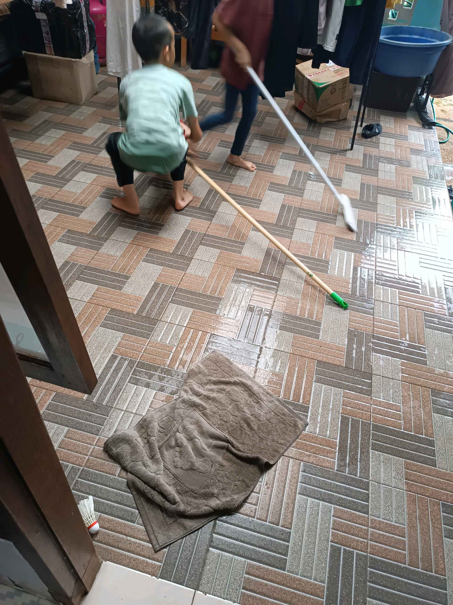

# 7 April 2026 - Log Kegiatan Harian
[Kembali](readme.md)

## 📌 Kegiatan
1. Kegiatan Utama:
   - Kegiatan: Bermain hujan-hujanan di halaman bersama abang dan adik saat hujan turun, lalu membantu pekerjaan rumah membersihkan dan mengepel lantai.
   - Alat/bahan: Alat pel, kain lap, air.
   - Durasi: -

## 🎯 Capaian Kegiatan
- Bergembira bermain di luar rumah bersama saudara.
- Membantu membersihkan dan mengepel lantai rumah.

## 🚧 Kendala
- 

## 🖼️ Dokumentasi Kegiatan

[Kembali](readme.md)
