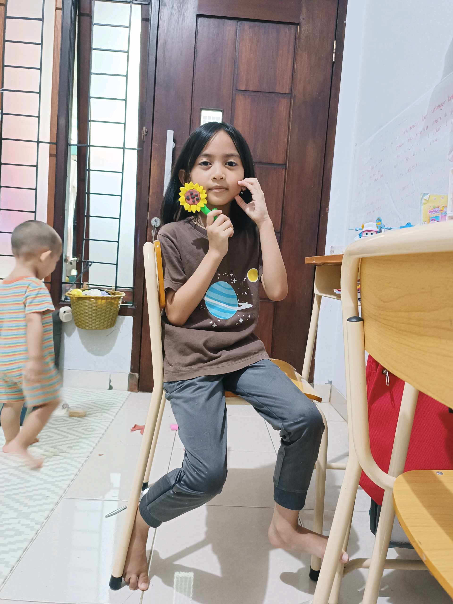

# 8 April 2026 - Log Kegiatan Harian
[Kembali](readme.md)

## 📌 Kegiatan
1. Kegiatan Utama:
   - Kegiatan: Membuat kerajinan bunga matahari dari clay/plastisin - membentuk kelopak, kepala bunga, batang, dan pot kecil.
   - Alat/bahan: Clay/plastisin warna-warni, alas kerja.
   - Durasi: -

## 🎯 Capaian Kegiatan
- Menyelesaikan karya kerajinan bunga matahari dari clay.
- Melatih motorik halus dan kreativitas membentuk.

## 🚧 Kendala
- 

## 🖼️ Dokumentasi Kegiatan

[Kembali](readme.md)
