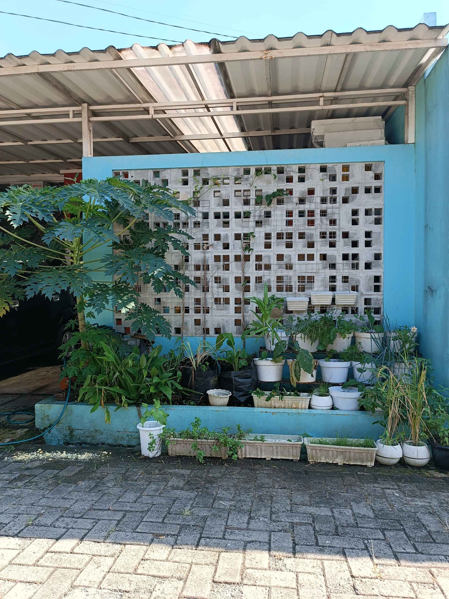
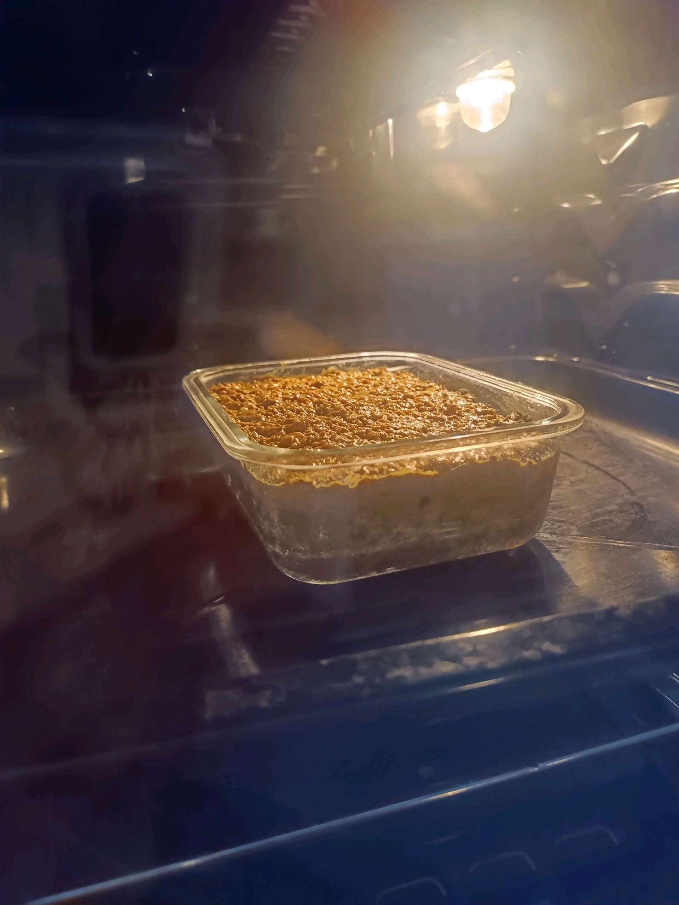

# 13 April 2026 - Log Kegiatan Harian
[Kembali](readme.md)

## 📌 Kegiatan
1. Kegiatan Utama:
   - Kegiatan: Merawat dan mengamati kebun urban farming (daun bawang, mint, kacang tanah, terong, dan pohon pepaya), lalu memasak hidangan panggang daging cincang berbumbu dengan lapisan telur dan daun salam (bobotie ala Afrika Selatan).
   - Alat/bahan: Tanaman pot kebun; daging cincang, bumbu, kunyit, telur, susu, daun salam, pinggan tahan panas, oven.
   - Durasi: -

## 🎯 Capaian Kegiatan
- Mengamati pertumbuhan tanaman di kebun sendiri.
- Membantu memasak hidangan panggang lintas budaya (bobotie) dari awal hingga matang.

## 🚧 Kendala
- 

## 🖼️ Dokumentasi Kegiatan

[Kembali](readme.md)
