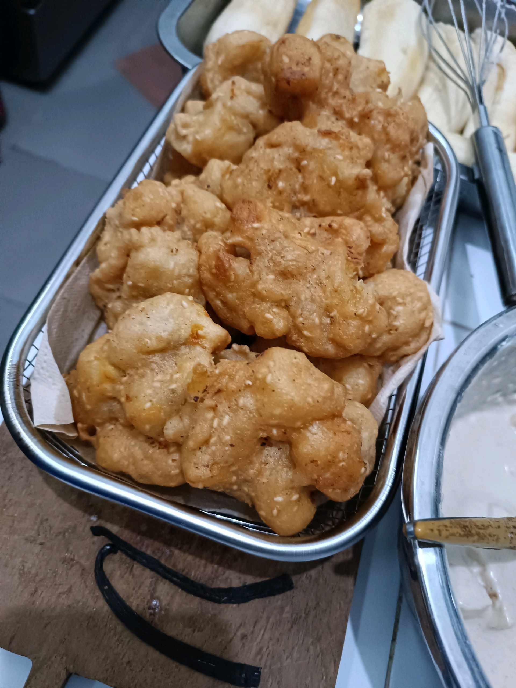

# 14 April 2026 - Log Kegiatan Harian
[Kembali](readme.md)

## 📌 Kegiatan
1. Kegiatan Utama:
   - Kegiatan: Membuat pisang goreng - mengupas pisang, mencelupkannya ke adonan tepung berwijen, lalu menggorengnya hingga renyah keemasan.
   - Alat/bahan: Pisang, tepung, wijen, minyak, wajan.
   - Durasi: -

## 🎯 Capaian Kegiatan
- Membantu membuat camilan pisang goreng untuk keluarga.
- Berlatih membuat adonan dan menggoreng dengan hati-hati.

## 🚧 Kendala
- 

## 🖼️ Dokumentasi Kegiatan

[Kembali](readme.md)
