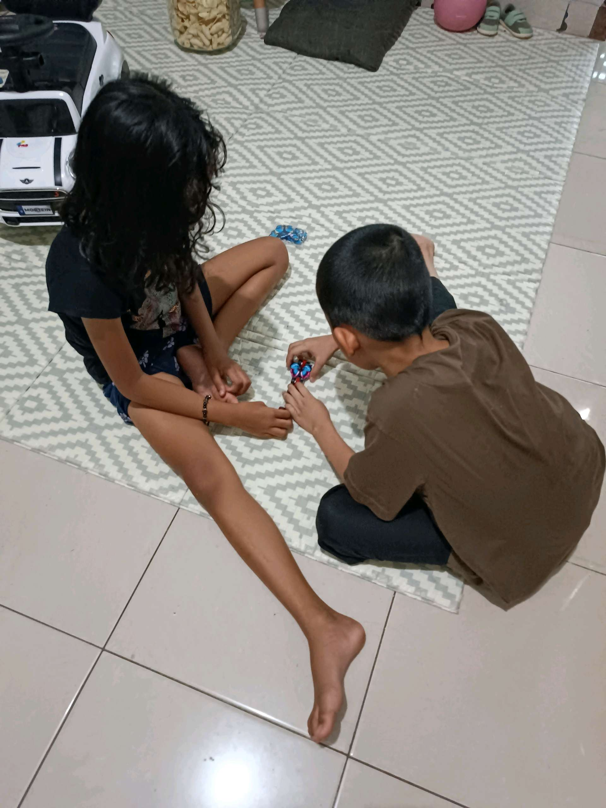

# 16 April 2026 - Log Kegiatan Harian
[Kembali](readme.md)

## 📌 Kegiatan
1. Kegiatan Utama:
   - Kegiatan: Bereksperimen dengan kit sains rangkaian listrik sederhana (baterai, motor, magnet, dan kabel) serta membuat prakarya kecil, ditemani bermain bersama abang.
   - Alat/bahan: Kit sains rangkaian listrik (motor, baterai, magnet, kabel), gunting, bahan prakarya.
   - Durasi: -

## 🎯 Capaian Kegiatan
- Mengenal cara kerja rangkaian listrik dan motor sederhana.
- Melatih rasa ingin tahu lewat eksperimen sains.

## 🚧 Kendala
- 

## 🖼️ Dokumentasi Kegiatan

[Kembali](readme.md)
