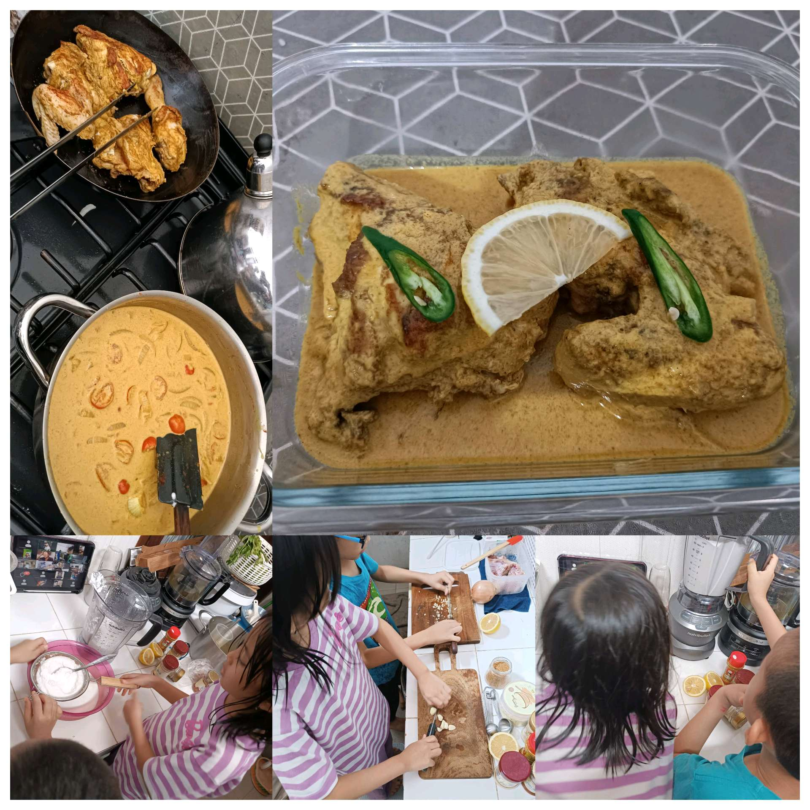
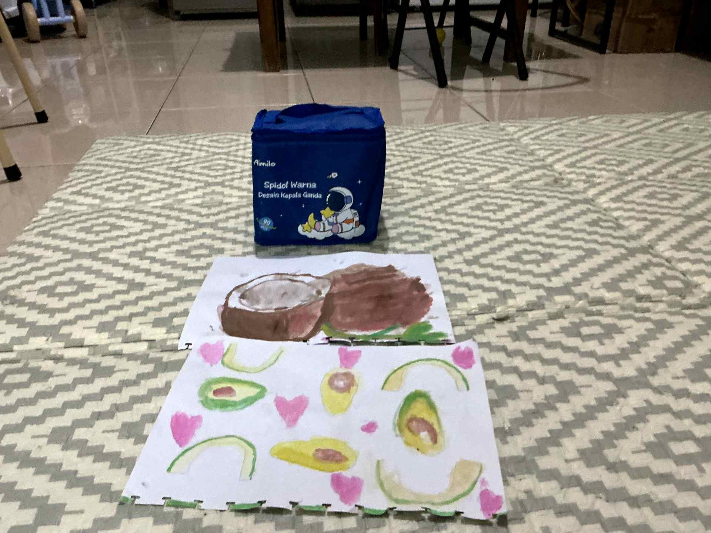

# 17 April 2026 - Log Kegiatan Harian
[Kembali](readme.md)

## 📌 Kegiatan
1. Kegiatan Utama:
   - Kegiatan: Mengikuti kelas memasak: mengiris bawang putih dan menghaluskan bumbu dengan blender untuk membuat ayam berkuah kari santan (dihias irisan lemon dan cabai hijau), serta melukis cat air bertema buah kelapa dan alpukat.
   - Alat/bahan: Ayam, bawang putih, bumbu, santan/krim, lemon, cabai hijau, blender; cat air, kuas, kertas.
   - Durasi: -

## 🎯 Capaian Kegiatan
- Membantu menyiapkan bumbu dan memasak ayam kari berkuah krim.
- Menyelesaikan lukisan cat air buah kelapa.

## 🚧 Kendala
- 

## 🖼️ Dokumentasi Kegiatan

[Kembali](readme.md)
