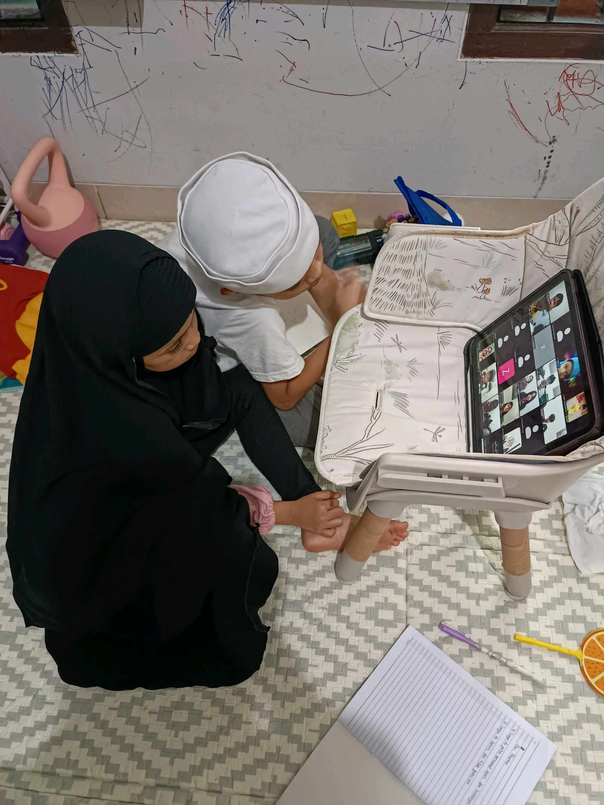

# 18 April 2026 - Log Kegiatan Harian
[Kembali](readme.md)

## 📌 Kegiatan
1. Kegiatan Utama:
   - Kegiatan: Mengikuti kelas daring (taklim) sambil mencatat di buku, memanen dan membersihkan kacang tanah dari kebun, lalu membuat camilan sehat bola-bola kurma cokelat berbalut kelapa.
   - Alat/bahan: Tablet, buku catatan; kacang tanah hasil panen; kurma, cokelat, kelapa.
   - Durasi: -

## 🎯 Capaian Kegiatan
- Mengikuti kelas daring dengan tertib dan mencatat.
- Memanen kacang tanah hasil tanam sendiri.
- Membuat camilan sehat bola kurma cokelat.

## 🚧 Kendala
- 

## 🖼️ Dokumentasi Kegiatan

[Kembali](readme.md)
