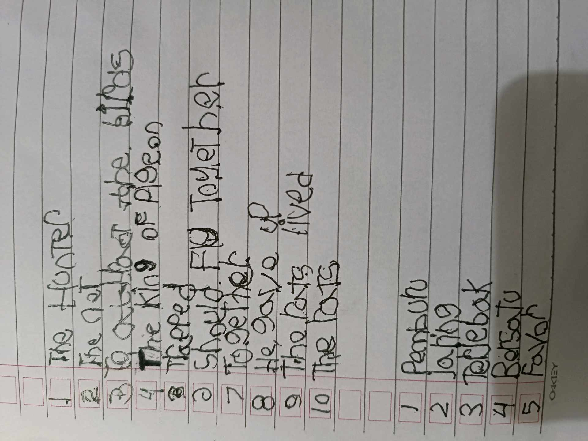
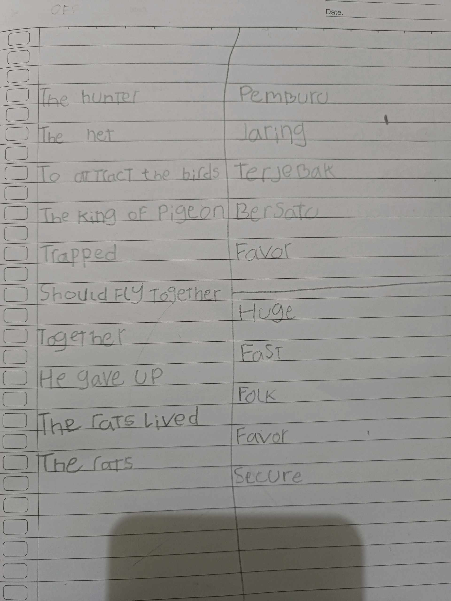

# 20 April 2026 - Log Kegiatan Harian
[Kembali](readme.md)

## 📌 Kegiatan
1. Kegiatan Utama:
   - Kegiatan: Belajar membaca dan kosakata bahasa Inggris dari cerita fabel 'The King of Pigeons' (sang pemburu dan burung-burung), lalu menerjemahkan kata-kata kunci ke bahasa Indonesia.
   - Alat/bahan: Buku tulis, alat tulis, teks cerita.
   - Durasi: -

## 🎯 Capaian Kegiatan
- Menerjemahkan kosakata bahasa Inggris (hunter=pemburu, net=jaring, trapped, secure, dan lainnya).
- Memahami pesan cerita tentang kerja sama dan persatuan.

## 🚧 Kendala
- 

## 🖼️ Dokumentasi Kegiatan

[Kembali](readme.md)
