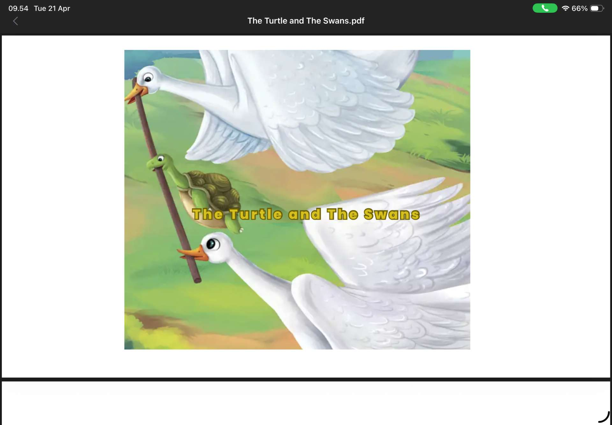

# 21 April 2026 - Log Kegiatan Harian
[Kembali](readme.md)

## 📌 Kegiatan
1. Kegiatan Utama:
   - Kegiatan: Membaca cerita berbahasa Inggris 'The Turtle and The Swans' (kura-kura dan angsa) lewat tablet, serta merapikan tempat tidur sesuai rutinitas pagi (morning routine).
   - Alat/bahan: Tablet/e-book, perlengkapan tidur.
   - Durasi: -

## 🎯 Capaian Kegiatan
- Berlatih membaca cerita berbahasa Inggris secara mandiri.
- Merapikan tempat tidur dengan disiplin.

## 🚧 Kendala
- 

## 🖼️ Dokumentasi Kegiatan

[Kembali](readme.md)
