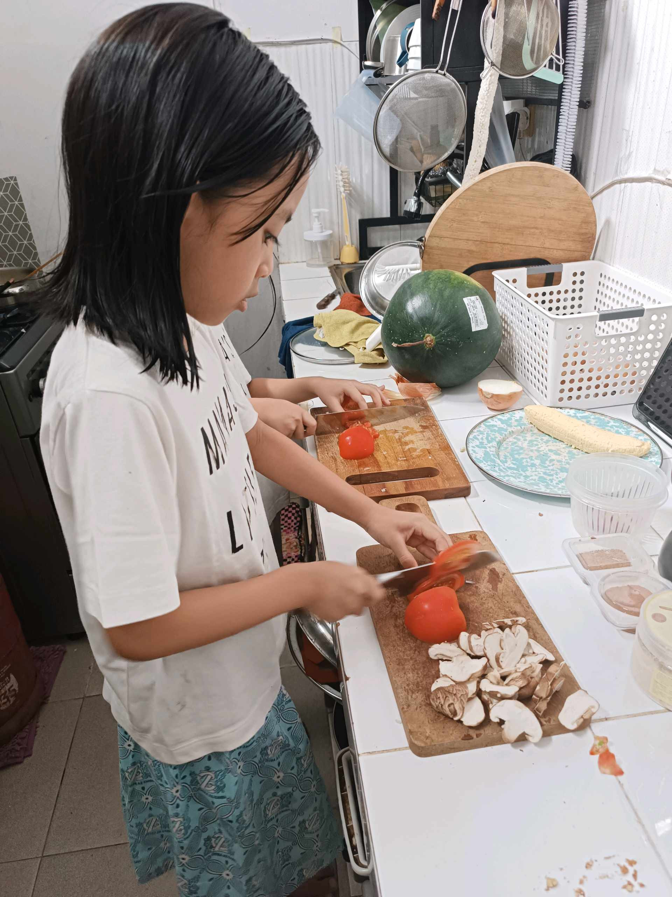
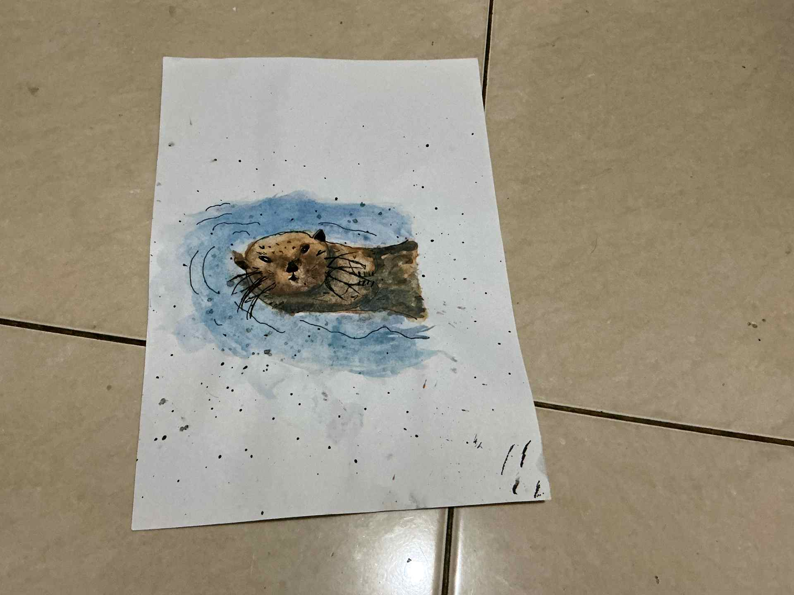
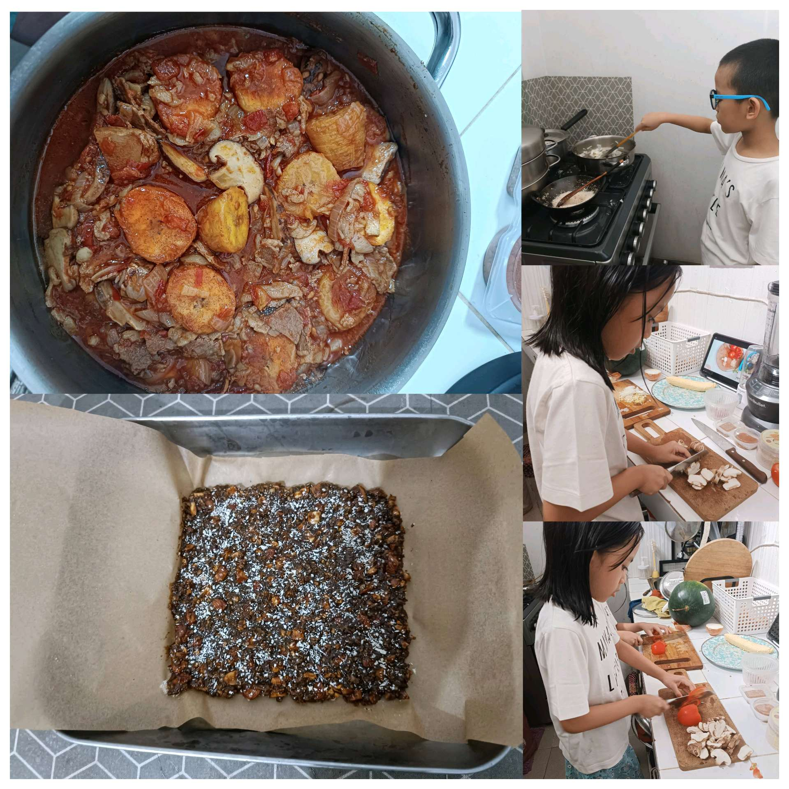

# 24 April 2026 - Log Kegiatan Harian
[Kembali](readme.md)

## 📌 Kegiatan
1. Kegiatan Utama:
   - Kegiatan: Memasak bersama abang - mengiris tomat dan jamur lalu memasak daging berkuah tomat dengan kentang dan jamur, membuat camilan batangan kurma-kacang, serta melukis cat air bertema berang-berang laut (sea otter).
   - Alat/bahan: Tomat, jamur, daging, kentang, bumbu; kurma, kacang; cat air, kuas, kertas.
   - Durasi: -

## 🎯 Capaian Kegiatan
- Membantu memasak hidangan berkuah tomat dari awal.
- Berlatih mengiris bahan dengan rapi mengikuti resep.
- Menyelesaikan lukisan cat air berang-berang laut.

## 🚧 Kendala
- 

## 🖼️ Dokumentasi Kegiatan

[Kembali](readme.md)
