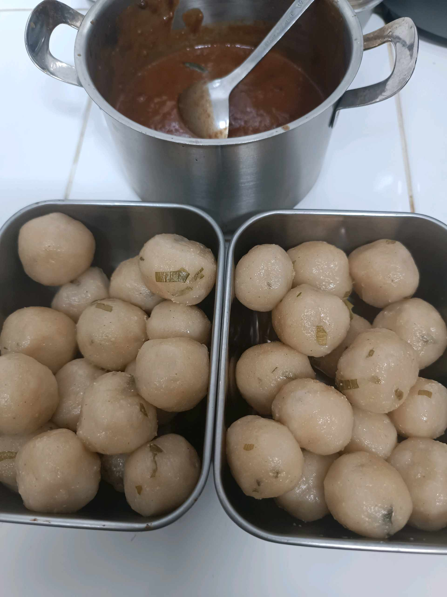

# 26 April 2026 - Log Kegiatan Harian
[Kembali](readme.md)

## 📌 Kegiatan
1. Kegiatan Utama:
   - Kegiatan: Membuat bakso/pentol buatan sendiri - membentuk adonan menjadi bulatan-bulatan dan memasaknya dalam kuah kaldu.
   - Alat/bahan: Adonan bakso (daging/ikan, tepung, daun bawang), panci, kuah kaldu.
   - Durasi: -

## 🎯 Capaian Kegiatan
- Membantu membentuk dan merebus bakso buatan sendiri.
- Berlatih ketelatenan membentuk bulatan bakso.

## 🚧 Kendala
- 

## 🖼️ Dokumentasi Kegiatan

[Kembali](readme.md)
