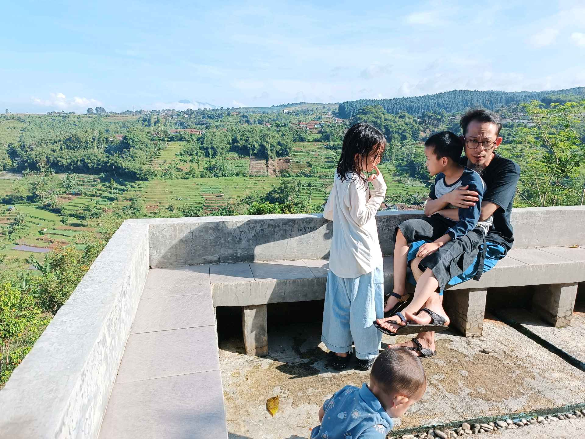

# 1 Mei 2026 - Log Kegiatan Harian
[Kembali](readme.md)

## 📌 Kegiatan
1. Kegiatan Utama:
   - Kegiatan: Berlibur bersama keluarga ke kawasan perbukitan berudara sejuk - menikmati pemandangan hamparan sawah berundak dari saung, berfoto bersama keluarga besar, dan mengamati jamur yang tumbuh di batang pohon.
   - Alat/bahan: -
   - Durasi: -

## 🎯 Capaian Kegiatan
- Menikmati kebersamaan keluarga di alam terbuka.
- Mengamati alam: pemandangan sawah berundak dan jamur kayu.

## 🚧 Kendala
- 

## 🖼️ Dokumentasi Kegiatan

[Kembali](readme.md)
