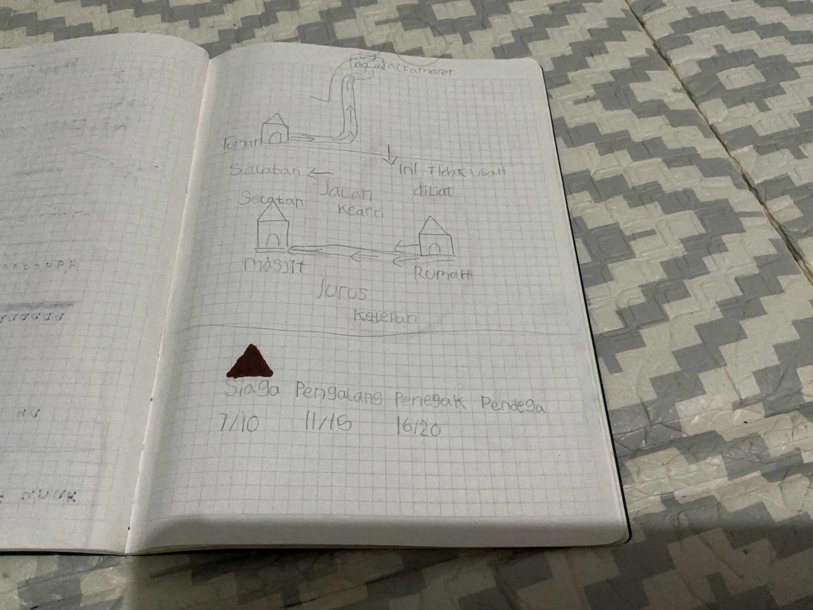

# 28 April 2026 - Log Kegiatan Harian
[Kembali](readme.md)

## 📌 Kegiatan
1. Kegiatan Utama:
   - Kegiatan: Belajar kepramukaan: mengenal tingkatan pramuka (Siaga, Penggalang, Penegak, Pandega), menggambar delapan arah mata angin beserta derajatnya, membuat denah perjalanan rumah-masjid, dan mengenal lambang/atribut pramuka.
   - Alat/bahan: Buku tulis, pensil, pensil warna.
   - Durasi: -

## 🎯 Capaian Kegiatan
- Memahami delapan arah mata angin beserta derajatnya.
- Membuat denah/peta rute sederhana.
- Mengenal tingkatan dan atribut kepramukaan.

## 🚧 Kendala
- 

## 🖼️ Dokumentasi Kegiatan

[Kembali](readme.md)
