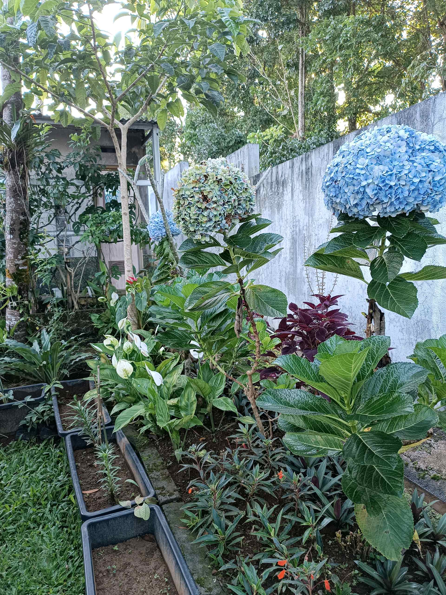

# 30 April 2026 - Log Kegiatan Harian
[Kembali](readme.md)

## 📌 Kegiatan
1. Kegiatan Utama:
   - Kegiatan: Saat liburan keluarga, mengamati keindahan taman dan tanaman bunga (hortensia biru, bunga lili) serta pepohonan di lingkungan sekitar.
   - Alat/bahan: -
   - Durasi: -

## 🎯 Capaian Kegiatan
- Mengamati keanekaragaman tanaman dan bunga di alam.
- Menumbuhkan kecintaan pada keindahan alam.

## 🚧 Kendala
- 

## 🖼️ Dokumentasi Kegiatan

[Kembali](readme.md)
