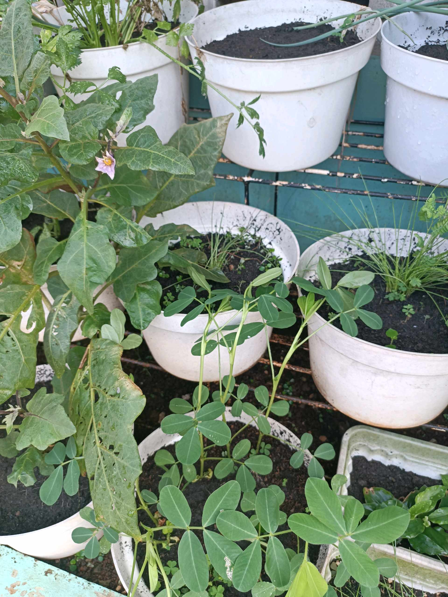

# 4 Mei 2026 - Log Kegiatan Harian
[Kembali](readme.md)

## 📌 Kegiatan
1. Kegiatan Utama:
   - Kegiatan: Merawat dan mengamati kebun urban farming - memperhatikan tanaman terong yang berbunga, tomat, kacang tanah, daun bawang, dan pandan.
   - Alat/bahan: Tanaman pot kebun, gembor/air.
   - Durasi: -

## 🎯 Capaian Kegiatan
- Mengamati pertumbuhan dan pembungaan tanaman di kebun sendiri.
- Merawat tanaman dengan telaten.

## 🚧 Kendala
- 

## 🖼️ Dokumentasi Kegiatan

[Kembali](readme.md)
