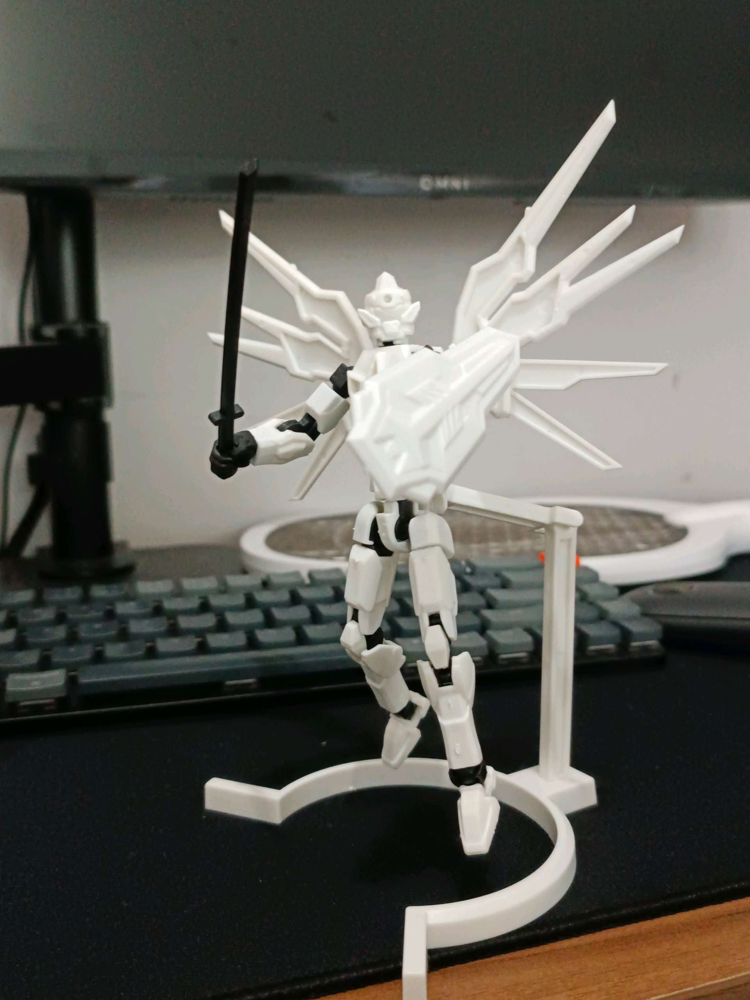
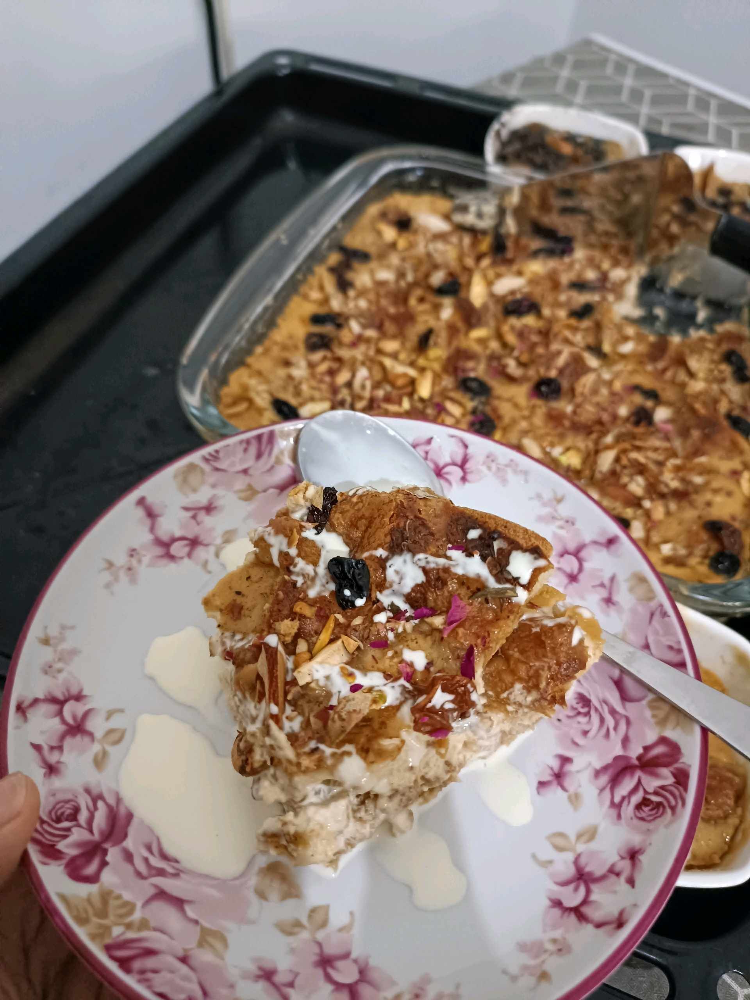

# 8 Mei 2026 - Log Kegiatan Harian
[Kembali](readme.md)

## 📌 Kegiatan
1. Kegiatan Utama:
   - Kegiatan: Membuat puding roti panggang ala Timur Tengah (umm ali) - menyobek roti, membuat custard susu, menabur kacang almond dan kismis, lalu memanggangnya; serta melukis cat air bertema buah apel dan merakit model kit (gunpla).
   - Alat/bahan: Roti, susu, telur, gula, kacang almond, kismis, oven; cat air, kuas, kertas; model kit (gunpla).
   - Durasi: -

## 🎯 Capaian Kegiatan
- Membantu membuat dessert lintas budaya (umm ali) dari awal hingga matang.
- Menyelesaikan lukisan cat air buah apel.
- Melatih ketelitian merakit model kit.

## 🚧 Kendala
- 

## 🖼️ Dokumentasi Kegiatan

[Kembali](readme.md)
