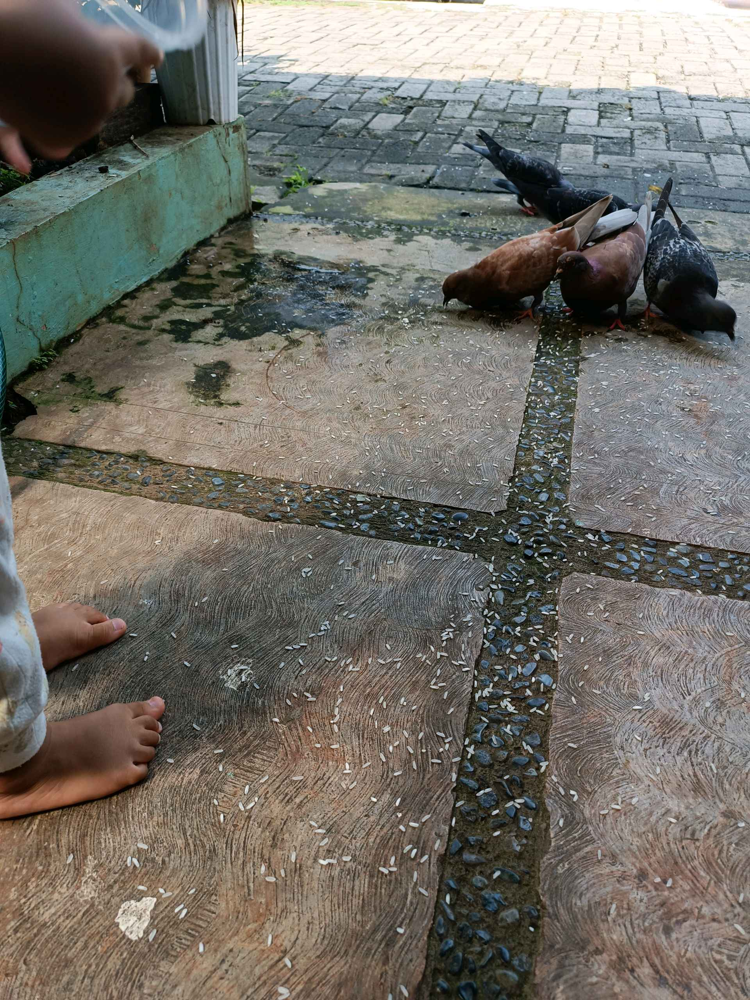
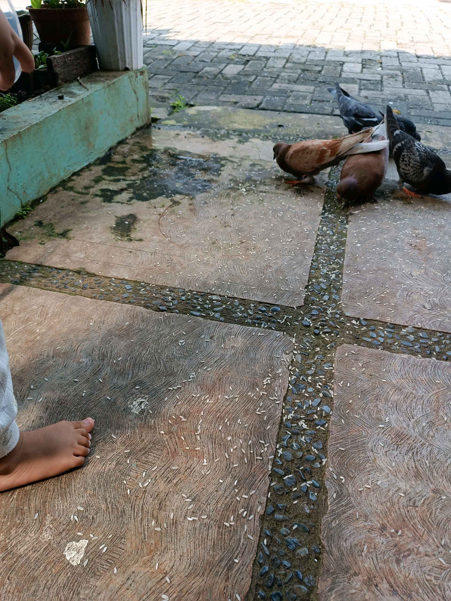

# 12 Mei 2026 - Log Kegiatan Harian
[Kembali](readme.md)

## 📌 Kegiatan
1. Kegiatan Utama:
   - Kegiatan: Memberi makan burung merpati di halaman - menebar butiran beras dan mengamati burung-burung yang datang makan.
   - Alat/bahan: Beras/butiran pakan.
   - Durasi: -

## 🎯 Capaian Kegiatan
- Belajar menyayangi dan merawat hewan.
- Mengamati perilaku burung merpati dari dekat.

## 🚧 Kendala
- 

## 🖼️ Dokumentasi Kegiatan

[Kembali](readme.md)
