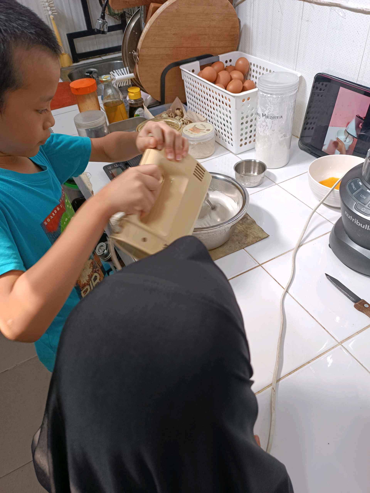
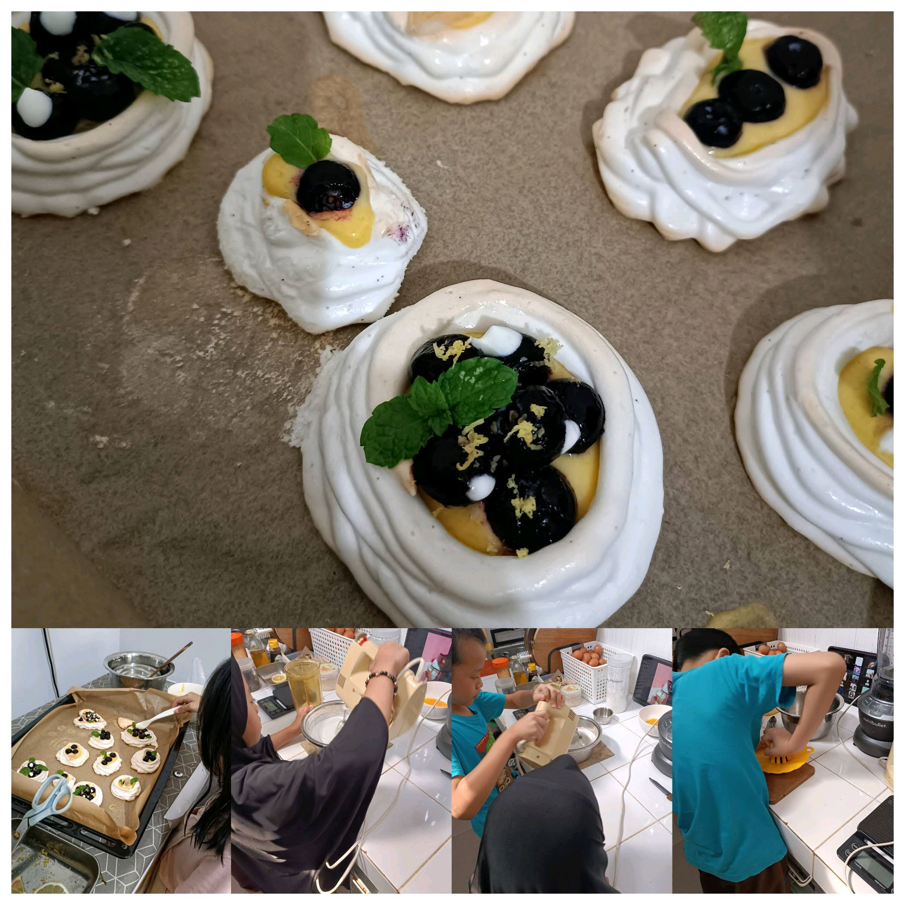

# 15 Mei 2026 - Log Kegiatan Harian
[Kembali](readme.md)

## 📌 Kegiatan
1. Kegiatan Utama:
   - Kegiatan: Mengikuti kelas memasak membuat mini pavlova - mengocok putih telur menjadi meringue, memanggangnya, lalu menghiasnya dengan lemon curd, blueberry, dan daun mint.
   - Alat/bahan: Putih telur, gula, lemon, blueberry, daun mint, mixer, oven; tablet untuk kelas daring.
   - Durasi: -

## 🎯 Capaian Kegiatan
- Membuat dessert lintas budaya (mini pavlova) dari awal hingga dihias.
- Berlatih teknik mengocok putih telur hingga kaku (meringue).

## 🚧 Kendala
- 

## 🖼️ Dokumentasi Kegiatan

[Kembali](readme.md)
