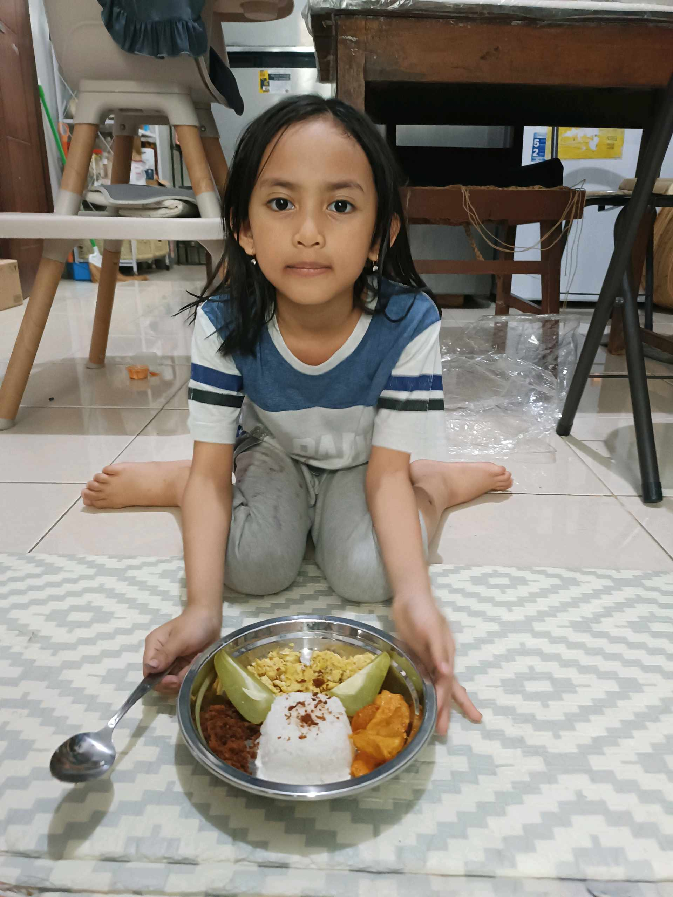

# 16 Mei 2026 - Log Kegiatan Harian
[Kembali](readme.md)

## 📌 Kegiatan
1. Kegiatan Utama:
   - Kegiatan: Menyiapkan dan menata makan - nasi dengan aneka lauk (telur orak-arik, serundeng, dan sayuran), lalu menyajikannya.
   - Alat/bahan: Nasi, telur, serundeng, sayuran; nampan/piring.
   - Durasi: -

## 🎯 Capaian Kegiatan
- Menata makanan (plating) menjadi menarik.
- Membantu menyiapkan makan keluarga.

## 🚧 Kendala
- 

## 🖼️ Dokumentasi Kegiatan

[Kembali](readme.md)
