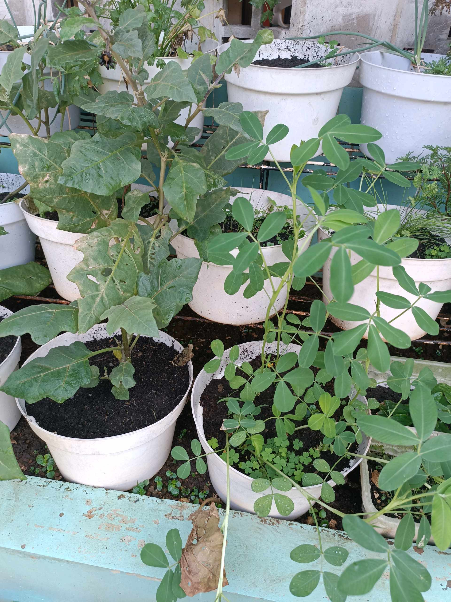
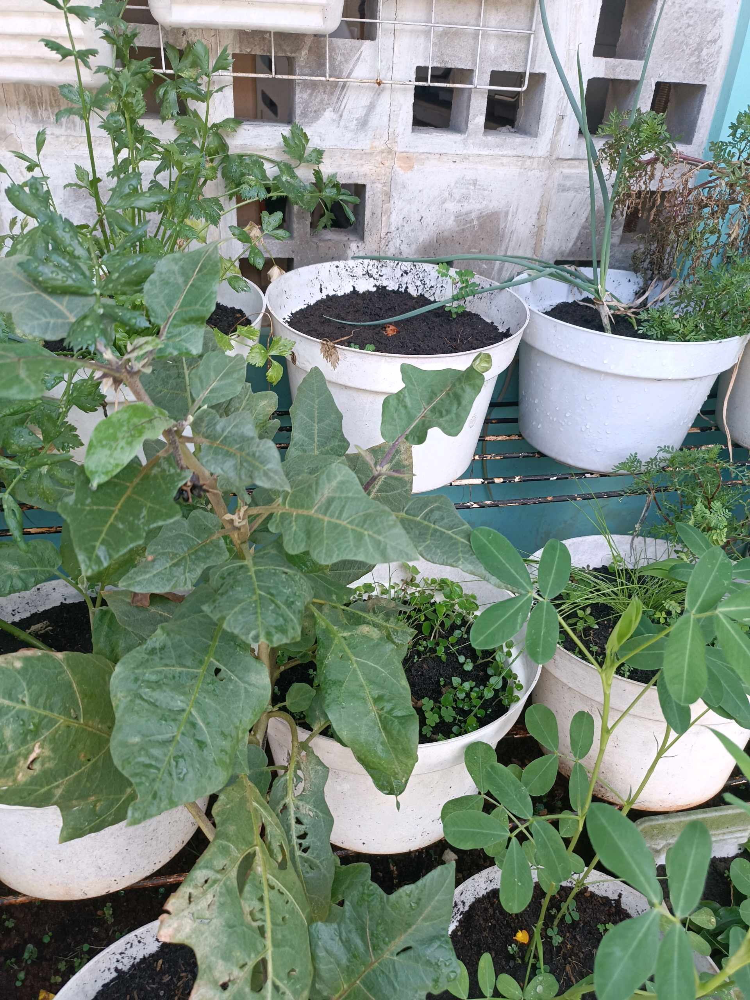

# 18 Mei 2026 - Log Kegiatan Harian
[Kembali](readme.md)

## 📌 Kegiatan
1. Kegiatan Utama:
   - Kegiatan: Merawat dan mengamati kebun urban farming (terong, kacang tanah, daun bawang, dan kelor).
   - Alat/bahan: Tanaman pot kebun.
   - Durasi: -

## 🎯 Capaian Kegiatan
- Mengamati pertumbuhan tanaman di kebun.
- Merawat tanaman dengan telaten.

## 🚧 Kendala
- 

## 🖼️ Dokumentasi Kegiatan

[Kembali](readme.md)
