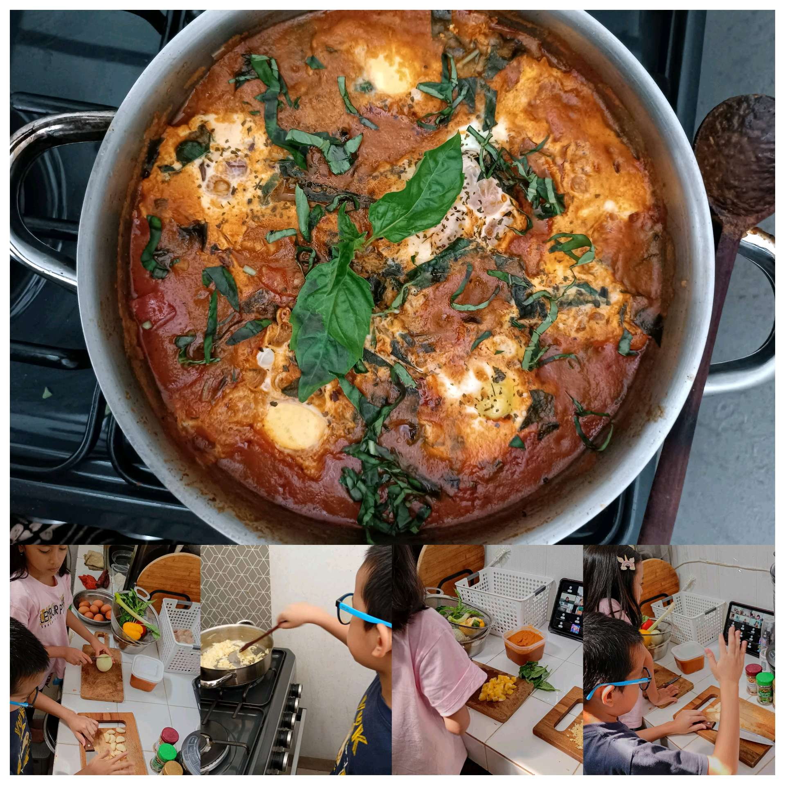

# 20 Mei 2026 - Log Kegiatan Harian
[Kembali](readme.md)

## 📌 Kegiatan
1. Kegiatan Utama:
   - Kegiatan: Mengikuti kelas memasak daring (Zoom) membuat hidangan telur berkuah tomat dan basil (ala shakshuka), serta menyiapkan nasi.
   - Alat/bahan: Tomat, basil, telur, keju, bumbu, panci; nasi; tablet untuk kelas daring.
   - Durasi: -

## 🎯 Capaian Kegiatan
- Membantu memasak hidangan lintas budaya berbahan tomat dan basil.
- Mengikuti instruksi memasak lewat kelas daring.

## 🚧 Kendala
- 

## 🖼️ Dokumentasi Kegiatan

[Kembali](readme.md)
