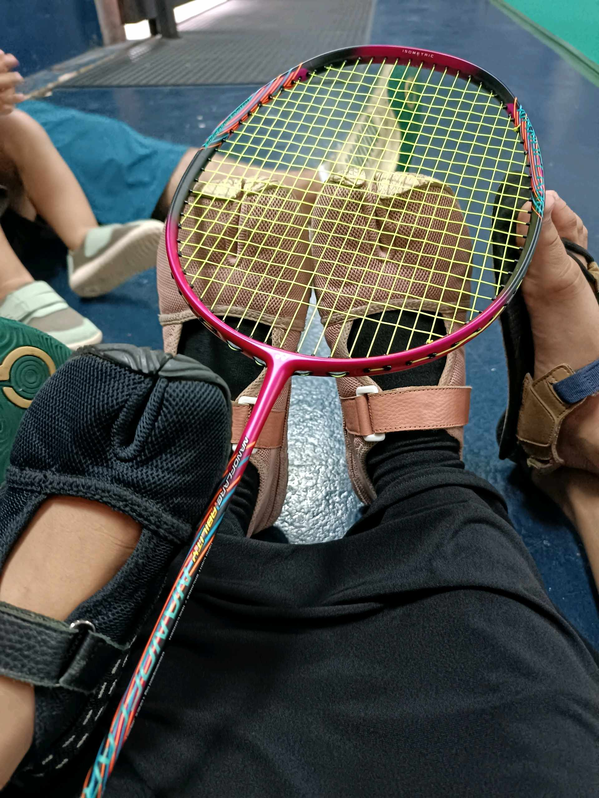

# 23 Mei 2026 - Log Kegiatan Harian
[Kembali](readme.md)

## 📌 Kegiatan
1. Kegiatan Utama:
   - Kegiatan: Berolahraga bermain bulu tangkis (badminton) di lapangan.
   - Alat/bahan: Raket bulu tangkis, kok, pelindung pergelangan.
   - Durasi: -

## 🎯 Capaian Kegiatan
- Melatih kebugaran dan koordinasi gerak lewat olahraga.
- Bermain sportif bersama.

## 🚧 Kendala
- 

## 🖼️ Dokumentasi Kegiatan

[Kembali](readme.md)
