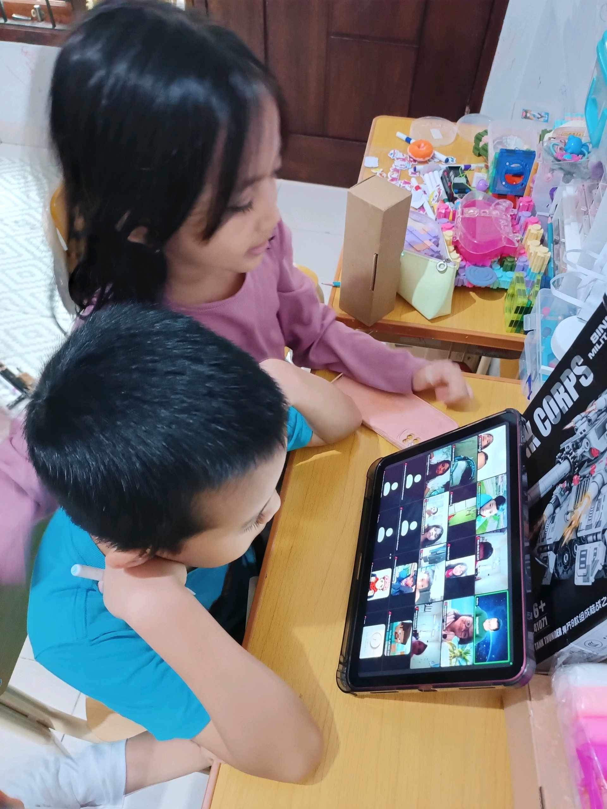

# 25 Mei 2026 - Log Kegiatan Harian
[Kembali](readme.md)

## 📌 Kegiatan
1. Kegiatan Utama:
   - Kegiatan: Mengikuti kelas daring sambil mengerjakan latihan pemahaman bacaan (reading comprehension) bahasa Indonesia di tablet, dan berlatih mengetik jawaban secara digital.
   - Alat/bahan: Tablet, keyboard; lembar soal digital.
   - Durasi: -

## 🎯 Capaian Kegiatan
- Menjawab soal pemahaman bacaan dengan teliti.
- Berlatih literasi digital (mengetik dan mengerjakan tugas di tablet).

## 🚧 Kendala
- 

## 🖼️ Dokumentasi Kegiatan

[Kembali](readme.md)
