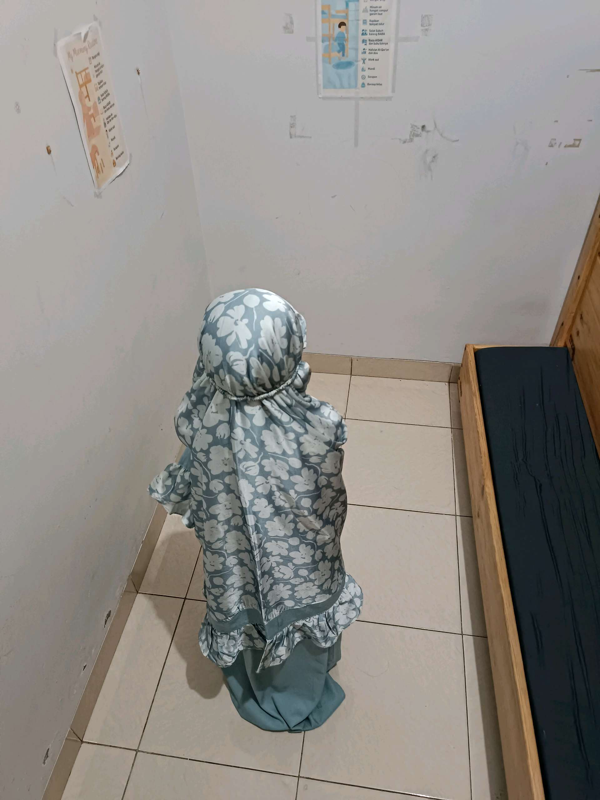

# 27 Mei 2026 - Log Kegiatan Harian
[Kembali](readme.md)

## 📌 Kegiatan
1. Kegiatan Utama:
   - Kegiatan: Menjalankan ibadah salat dengan mengenakan perlengkapan salat (peci dan mukena), berlatih tertib mengikuti gerakan dan rutinitas harian.
   - Alat/bahan: Perlengkapan salat (peci, mukena, sajadah).
   - Durasi: -

## 🎯 Capaian Kegiatan
- Membiasakan ibadah salat dengan tertib.
- Menjalankan rutinitas harian secara mandiri.

## 🚧 Kendala
- 

## 🖼️ Dokumentasi Kegiatan

[Kembali](readme.md)
