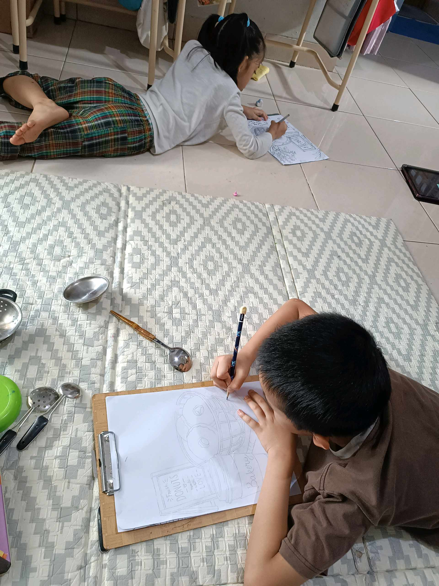

# 28 Mei 2026 - Log Kegiatan Harian
[Kembali](readme.md)

## 📌 Kegiatan
1. Kegiatan Utama:
   - Kegiatan: Berlatih menggambar/sketsa benda (still life) - mengamati dan menggambar peralatan dapur (centong dan sendok sayur) dengan pensil di atas kertas.
   - Alat/bahan: Pensil, kertas, papan jalan (clipboard); benda model (centong, sendok sayur).
   - Durasi: -

## 🎯 Capaian Kegiatan
- Berlatih menggambar berdasarkan pengamatan langsung (observasi).
- Melatih ketelitian menangkap bentuk dan proporsi benda.

## 🚧 Kendala
- 

## 🖼️ Dokumentasi Kegiatan

[Kembali](readme.md)
